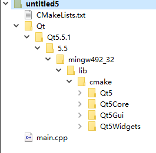

# 说明

我们都知道，make工具的出现就是为了解决编写Makefile时，依赖太多的问题，而make的工具也有很多种，比如常用的cmake，Qt的qmake等。本文主要介绍一些CMake和Qt的交互使用。

# 使用QtCreator管理cmake工程

Qt默认使用qmake生成Makefile，整个过程需要一个pro文件，就是写Qt程序时常见的工程配置文件，对于一般的Qt程序来说，这已经足够了。

然后，也可以使用cmake替代qmake，而常用的Qt Creator也可以用来管理使用cmake的工程。具体方法如下：

**步骤一：**

安装cmake工具，有问题请参考cmake相关的文章。

**步骤二：**

在QtCreator中配置cmake工具。

依次点击 **工具-选项**，打开配置界面，选择 **构建和运行**，在右边的CMake中查看添加的cmake工具，一般会自动检测到，若没有检测到，可以手动添加。


**步骤三：**

创建cmake工程

按照常用的创建方法，在选择模板的时候，选择 **Non-Qt Project**，右侧，有选择C项目还是C++项目


**步骤四：**

构建运行

项目创建完成之后，项目目录下只有 **CMakeList.txt** 和 **main.cpp** 两个文件

右键项目，执行CMake，在弹出的框子内，可以输入自定义参数

完成之后，会生成 Makefile 文件，构建运行即可

# 在cmake项目中使用Qt库

Qt作为一个C++库，其有着丰富的功能封装，利用Qt的库，可以实现大多数的需求。使用默认的qmake可以很方便地使用Qt类，那么若是使用cmake呢？当然也可以，官方也是相关说明，在 Assistant 搜索cmake即可查看，官方文档却主推qml，且不够清晰，所以，这里重新尝试，并总结如下：

## 配置CMakeLists.txt

主要需要在CMakeLists.txt中添加Qt的库，步骤如下：

**步骤一：设置Qt库路径**

开发环境中可能添加很多不同版本的Qt，并设置环境变量 **QTDIR**，则需要如下设置：

```cmake
set(CMAKE_PREFIX_PATH $ENV{QTDIR})
```

**$ENV()** 表示使用环境变量。

这样设置的好处是，如果有需要，可以更改Qt的版本

**步骤二：查找Qt模块**

官方文档在此步骤上说的不清不楚，其实，此步类似在pro文件中加上 **Qt += Core** 等语句

```cmake
find_package(Qt5 COMPONENTS core gui widgets)
```

**COMPONENTS** 后面就是需要添加的模块组件

**步骤三：链接**

编译最后，链接的时候，需要链接Qt的模块

```cmake
target_link_libraries(${PROJECT_NAME} Qt5::Core Qt5::Gui Qt5::Widgets)
```

如上，链接的模块和步骤二添加的模块相同

保存，执行cmake后，项目树型目录下，会出现添加的模块



最后构建运行即可

```c++
#include <QDebug>
#include <QDialog>
#include <QApplication>

int main(int argc, char *argv[])
{
    QApplication app(argc, argv);

    qDebug()<<"123";

    QDialog dialog;
    dialog.show();

    return app.exec();
}
```

**需要注意的是，若是使用Qt Quick则需要打开自动选项，具体可以参考官方文档**