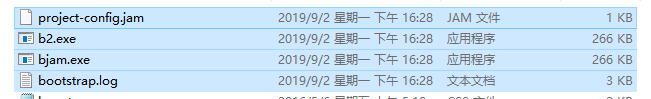

## 一、说明

理论上，Qt和boost是同等级别的C++库，如果使用Qt，一般不会需要再用boost，但是偶尔也会有特殊情况，比如，第三方库依赖等等。本文主要介绍boost在windows Qt(MinGW)中的使用。

MinGW是一组工具集，其中使用的gcc编译器，这里就需要使用gcc编译boost。

## 二、配置gcc

### （1）检查gcc环境变量

gcc工具位于Qt的安装目录下 ***..\Qt\Qt5.5.1\Tools\mingw492_32\bin*** 目录内，一般安装Qt的时候，并不会把此目录添加到系统的环境变量中，这里加进去即可

添加完成后，使用 

```cmake
gcc -v
```

指令查看gcc版本信息

## 三、编译boost

本例使用 ***boost 1.61.0***，其他版本类似，步骤如下：

### （1）生成b2.exe和bjam.exe

进入到boost的根目录下，执行 ***bootstrap.bat***，完成后，在根目录下生成4个文件：




***b2.exe*** 和 ***bjam.exe*** 的功能是一样的，只是b2.exe是升级版本而已

### （2）编译boost

在根目录下使用指令开始编译，编译时间较长

```cmake
bjam --toolset=gcc --prefix=E:\boost_1_61_0 install
```

**命令简介：**

1. **toolset：**指定编译器，可选：gcc/msvc/msvc-9.0等；
2. **build-dir：**编译生成的中间文件路径，这里没有用，则默认在根目录下的**bin.v2**中，编译完成后，其中文件即无用；
3. **stage/install：**stage表示只生成库（dll和lib），install表示还会生成头文件，头文件在根目录下有，其实无需再次生成
4. **without/with：**指定编译哪些库
5. **stagedir/prefix：**表示编译生成文件的路径，stage使用stagedir，install使用prefix
6. **debug/release：**版本

### （3）使用boost

编译完成后，在指定的目录下可以找到编译完成的文件，头文件和库文件的添加方式不做赘述

至此，boost可使用

测试代码：

```c++
#include <QCoreApplication>
#include <QDebug>
#include <boost/array.hpp>
using namespace boost;

int main(int argc, char *argv[])
{
    QCoreApplication a(argc, argv);

    array<int, 3> arr = {0, 1, 2};
    array<int, 3>::iterator iter = arr.begin();
    for(; iter != arr.end(); ++iter)
    {
        qDebug()<<*iter;
    }

    return a.exec();
}
```


