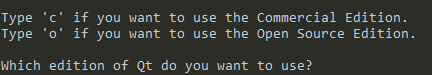

# 一、说明

用Qt做项目很久了，一直都是安装Qt，在其Qt的环境内开发，哪怕在 ***cmake和 Qt的使用*** 一文中，在cmake项目中引入Qt框架，也使用的是Qt官方建议的做法。今天，就尝试一下，真正把Qt当作第三方库使用，通过依赖库的形式使用Qt库。

在这之前，我们假定你已经对Qt有了足够的认识，并且已经使用过很多Qt的特性。

# 二、Qt源码的编译

本次以windows系统下说明，Linux下类似。

## 1、编译说明

本次，我们不再通过安装Qt，而是将Qt的源码进行编译使用。如果你安装过Qt，应该知道，安装的时候可选是否安装源码，如果安装了，那么可以在安装目录下找到Qt的源码。如果本机没有源码，则需要去官网下载。

我们都知道，Qt是一个模块化的C++库，比如GUI、网络处理、数据库等功能属于不同的模块，我们在用pro文件引入功能的时候，需要使用 **QT += xxxx** 即表示引入模块。比如要使用数据库功能，单纯加头文件是行不通的，还需要在项目的 pro 文件加入 **QT += sql**，并重新执行qmake。可以这样理解，pro文件中加入 **QT += sql** 即表示，添加sql的链接库，即类似 cmake 中的 **target_link_libraries** 操作。

通过查看Qt的源码目录可以发现，正如之前说的模块化一样，Qt的源码也是按照模块进行分类的，假设我们本次只需要使用Qt的QDomDocument进行xml解析，通过查询Qt手册发现，此功能需要添加core和xml模块，所以我们本次只需要编译 **qtbase** 即可，那么，我么也只需要下载qtbase的源码即可。

## 2、源码编译

进入qtbase源码目录下，内容如下：


按照以往经验，我们可以发现可能需要的文件包括：qtbase.pro、configure.exe、configure.bat和INSTALL

打开INSTALL文件查看内容，可以看到，里面是编译的文档url，官方的描述比较详细，如果需要可以参考官方文档

假定我们没有安装Qt，则也没有qmake，那么 qtbase.pro 文件暂时不需要

至于configure.xxx，可能，打开 configure.bat 可以发现，其内部最后也是调用了 configure.exe，调用之前会有一些处理，所以，我们执行 configure.bat 文件即可，配置过程中，有两处需要选择，根据需要选择即可：




配置一般不会出错，配置完成之后，在根目录下的bin目录下，可以找到qmake工具。目录下也会出现 **Makefile** 文件，接着执行make指令来编译，编译可能需要较长的时间。编译完成之后，在根目录下的lib文件夹中就会出现各个模块的链接库文件。

到此，编译完成，使用方式不详细说明，因为我本次需要使用xml，所以将core和xml模块添加到了我的项目中，CMakeLists.txt 修改

```cmake
target_link_libraries(${PROJECT_NAME}
    ${PROJECT_SOURCE_DIR}/libs/libQt5Core.a
    ${PROJECT_SOURCE_DIR}/libs/libQt5Xml.a
)
```

并将Qt源码根目录下的include目录下的对应文件夹copy并添加到了我的项目中，dll放在执行路径下，然后代码调用测试

```c++
#include <iostream>
#include <QtCore/QString>
#include <QtCore/QFile>
#include <QtXml/QDomDocument>
using namespace std;

int main()
{
    QDomDocument doc("test_xml");
    QFile xmlFile("111.xml");
    QString errorMessage;
    if(!doc.setContent(&xmlFile, &errorMessage))
    {
        cout<<"set content fail:"<<errorMessage.toStdString().c_str()<<endl;
        return 0;
    }
    QDomElement root_element = doc.documentElement();
    cout<<root_element.tagName().toStdString().c_str()<<endl;
    QDomNode node = root_element.firstChild();
    while(!node.isNull())
    {
        cout<<"-"<<node.toElement().tagName().toStdString().c_str()<<endl;
        node = node.nextSibling();
    }
    return 0;
}
```

重新cmake并编译，发现报错，内容大概是找不到对应的头文件。我检查了一下报错地方发现，项目的include目录下添加的Qt的头文件并没有实质的内容，而是又include一个路径下的头文件。检查include路径，发现是根目录下的src的目录下对应的模块中，头文件会有实质内容，而我将include内容copy到项目目录下，导致相对路径改变，找不到文件了。

这里有两种方法可以解决，可以将源码目录下的src目录中的需要的模块的文件夹也copy到项目的根目录下，或者，不做任何移动操作，将源码目录下的include路径添加到项目中，可解决头文件不存在的报错。

解决之后，构建执行正确，OK，到此完结

# 三、总结

说到Qt，很多人都会先入为主的说这是一个GUI的框架。其实，官方也说明，Qt是一个C++的框架，是和boost等框架一样的，而不仅仅是GUI，其中的很多功能都很优秀，值得我们学习。

