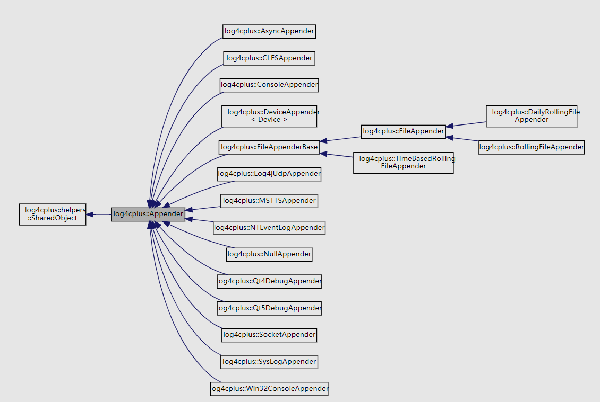
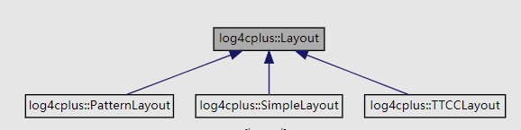

# 一、前言

一直以来，我使用c++开发的时候的日志都使用Qt的QDebug模块导向文件，虽然中间自己改过源码，实现了向下兼容的分模块保存日志的功能，但是这都是简单浅显的日志功能。

而对于大型系统的开发，自己写的简单的类库就显得心有余而力不足了，所以现在开始使用一些著名的日志系统。本篇主要介绍 **log4cplus** 的简单使用。

下面的链接中使用趣味的故事介绍了log4j的设计方法，而 **log4cplus** 则是log4j在c++上的移植版，接口和功能基本相同。

[一个著名的日志系统如何设计出来的？](https://mp.weixin.qq.com/s/XiCky-Z8-n4vqItJVHjDIg)

**log4cplus** API文档：[log4cplus Documentation](https://log4cplus.sourceforge.io/docs/html/index.html)

# 二、log4cplus的基本类

| 类     | 说明 |
| ------ | ---- |
| Logger | 日志记录句柄 |
| Appender | 日志的输出源，表示该日志需要输出到哪里，可以添加多个 |
| Layout | 日志输出格式，一个Appender一个Layout |
| Hierarchy | 分层器，用于记录信息的分类 |
| LogLevel | 优先权，包含TRACE,  DEBUG, INFO, WARNING, ERROR, FATAL |

**Logger：** 句柄，用于获取记录日志的实例

**Appender：** 顾名思义，输出源，它可以配置接下来的日志内容输出到哪里，比如，输出到console、文件、远程的log服务器等其中一个或者多个

**Layout：** 用于表示记录的日志的格式，一个Appender一个Layout，但是若是输出到远程的log服务器则不需要Layout

所以，使用的步骤大致如下：

1. 初始化 **log4cplus**；
2. 创建 **Appender** 对象；
3. 设置 **Appender** 对象的名称和输出的 **Layout**；
4. 使用 **Logger** 实例添加 **Appender**；
5. 使用宏定义输出日志；

# 三、支持的Appender和Layout

log4cplus支持的输出源很多，每种Appender都继承自Appender，类图如下所示：



支持的Layout如下：



# 四、代码示例

## （1）输出日志到console

```c++
int main() {
	//初始化
	Initializer initializer;
	//创建指向console的appender
	SharedAppenderPtr appender(new ConsoleAppender());
	//设置appender的layout
	appender->setName(LOG4CPLUS_TEXT("console"));
	appender->setLayout(std::unique_ptr<Layout>(new SimpleLayout));

	//获取logger实例
	Logger logger = Logger::getInstance(LOG4CPLUS_TEXT("test"));
	//设置这个logger实例的log输出等级
	logger.setLogLevel(INFO_LOG_LEVEL);
	//添加appender
	logger.addAppender(appender);
	//利用宏定义输出日志
	LOG4CPLUS_INFO(logger, LOG4CPLUS_TEXT("test log中文测试"));

	return 0;
}
```

## （2）输出日志到文件

```c++
int main() {
	//初始化
	Initializer initializer;

	//创建指向文件的appender
	tstring fileName = LOG4CPLUS_TEXT("mylog.log");
	SharedAppenderPtr fileAppender(new FileAppender(fileName, std::ios_base::app));
	fileAppender->setName(LOG4CPLUS_TEXT("file"));
	tstring pattern = LOG4CPLUS_TEXT("%D{%y-%m-%d %H:%M:%S,%Q} [%t] %-5p %c - %m [%l]%n");
	fileAppender->setLayout(std::unique_ptr<Layout>(new PatternLayout(pattern)));

	//获取logger实例
	Logger logger = Logger::getInstance(LOG4CPLUS_TEXT("test"));
	//设置这个logger实例的log输出等级
	logger.setLogLevel(INFO_LOG_LEVEL);
	//添加appender
	logger.addAppender(fileAppender);
	//利用宏定义输出日志
	LOG4CPLUS_INFO(logger, LOG4CPLUS_TEXT("test log"));

	return 0;
}
```

## （3）输出日志到日志服务器

```c++
int main() {
	//初始化
	Initializer initializer;
	//创建日志服务器appender
	SharedAppenderPtr socketAppender(
        new SocketAppender(LOG4CPLUS_TEXT("127.0.0.1"), 8888, LOG4CPLUS_TEXT("test"))
    );
	socketAppender->setName(LOG4CPLUS_TEXT("logserver"));

	//获取logger实例
	Logger logger = Logger::getInstance(LOG4CPLUS_TEXT("test"));
	//设置这个logger实例的log输出等级
	logger.setLogLevel(INFO_LOG_LEVEL);
	//添加appender
	logger.addAppender(socketAppender);
	//利用宏定义输出日志
	LOG4CPLUS_INFO(logger, LOG4CPLUS_TEXT("test log中文测试"));

	return 0;
}
```

日志服务器的示例，参考示例代码 **loggingserver.cxx**

# 五、使用配置文件

log4系列的日志框架的优势在于使用灵活，也可以使用配置文件进行控制，示例代码如下：

```c++
#include <./log4cplus/log4cplus.h>
using namespace log4cplus;

int main() {
	PropertyConfigurator::doConfigure(LOG4CPLUS_TEXT("log.properties"));
	Logger logger = Logger::getRoot();
    //Logger logger = Logger::getInstance(LOG4CPLUS_TEXT("test1"));

	LOG4CPLUS_TRACE(logger, LOG4CPLUS_TEXT("printMessages()"));
	LOG4CPLUS_DEBUG(logger, LOG4CPLUS_TEXT("This is a DEBUG message"));
	LOG4CPLUS_INFO(logger, LOG4CPLUS_TEXT("This is a INFO message"));
	LOG4CPLUS_WARN(logger, LOG4CPLUS_TEXT("This is a WARN message"));
	LOG4CPLUS_ERROR(logger, LOG4CPLUS_TEXT("This is a ERROR message"));
	LOG4CPLUS_FATAL(logger, LOG4CPLUS_TEXT("This is a FATAL message"));

	return 0;
}
```

常用配置文件

logger分为五个等级：**DEBUG < INFO < WARN < ERROR < FATAL**

```properties
#配置root logger
#DEBUG表示该logger记录DEBUG等级以上的log
log4cplus.rootLogger=DEBUG,ALL_MSGS,ERROR_MSGS
#也可以定义自定义的logger，可以在代码中使用Logger::getInstance获取此looger
#注意rootLogger和自定义的logger不一样
#log4cplus.logger.test1=DEBUG,ALL_MSGS,ERROR_MSGS

#每天产生一个配置文件
log4cplus.appender.ALL_MSGS=log4cplus::DailyRollingFileAppender
log4cplus.appender.ALL_MSGS.Schedule=DAILY
#log4cplus.appender.ALL_MSGS.DatePattern=yyyy-MM-dd
#log文件大小，可以是MB/KB/GB
log4cplus.appender.ALL_MSGS.MaxFileSize=100MB
#产生的滚动文件最大个数，2则表示可以生成log.log.1、log.log.2，剩下的log放在最后一个文件中
log4cplus.appender.ALL_MSGS.MaxBackupIndex=2
#是否自动创建文件夹
log4cplus.appender.ALL_MSGS.CreateDirs=true
#log文件路径
log4cplus.appender.ALL_MSGS.File=.\log\log.log
#使用PatternLayout layout
log4cplus.appender.ALL_MSGS.layout=log4cplus::PatternLayout
#日志显示格式
log4cplus.appender.ALL_MSGS.layout.ConversionPattern=%d{%Y-%m-%d %H:%M:%S,%Q} %-4l [%t] %-5p %c{2} - %m%n
#配置该文件记录的日志等级范围，即日志等级在此范围的日志才会在此记录
log4cplus.appender.ALL_MSGS.filters.1=log4cplus::spi::LogLevelRangeFilter
#最小等级是TRACE
log4cplus.appender.ALL_MSGS.filters.1.LogLevelMin=INFO
#最大等级是FATAL
log4cplus.appender.ALL_MSGS.filters.1.LogLevelMax=FATAL
#控制匹配的appender是否打印日志
log4cplus.appender.ALL_MSGS.filters.1.AcceptOnMatch=false

log4cplus.appender.ERROR_MSGS=log4cplus::DailyRollingFileAppender
log4cplus.appender.ERROR_MSGS.Schedule=DAILY
log4cplus.appender.ERROR_MSGS.MaxFileSize=100MB
log4cplus.appender.ERROR_MSGS.MaxBackupIndex=10
log4cplus.appender.ERROR_MSGS.CreateDirs=true
log4cplus.appender.ERROR_MSGS.File=.\log\error.log
log4cplus.appender.ERROR_MSGS.layout=log4cplus::PatternLayout
log4cplus.appender.ERROR_MSGS.layout.ConversionPattern=%d{%Y-%m-%d %H:%M:%S,%Q} %-4l [%t] %-5p %c{2} - %m%n
#Match 
log4cplus.appender.ERROR_MSGS.filters.1=log4cplus::spi::LogLevelMatchFilter
#只打印ERROR等级的日志
log4cplus.appender.ERROR_MSGS.filters.1.LogLevelToMatch=ERROR
log4cplus.appender.ERROR_MSGS.filters.1.AcceptOnMatch=true
log4cplus.appender.ERROR_MSGS.filters.2=log4cplus::spi::DenyAllFilter
```

lo4cplus的配置文件说明较少，可以参考log4j的配置文件说明

## 格式化符号说明

| 符号 | 说明 |
| ---- | ---- |
|%p|输出日志信息的优先级，即DEBUG，INFO，WARN，ERROR，FATAL|
|%d|输出日志时间点的日期或时间，默认格式为ISO8601，也可以在其后指定格式，如：%d{yyyy/MM/dd HH:mm:ss,SSS}。|
|%r|输出自应用程序启动到输出该log信息耗费的毫秒数。|
|%t|输出产生该日志事件的线程名。|
|%l|输出日志事件的发生位置，相当于%c.%M(%F:%L)的组合，包括类全名、方法、文件名以及在代码中的行数。例如：test.TestLog4j.main(TestLog4j.java:10)。|
|%c|输出日志信息所属的类目，通常就是所在类的全名。|
|%M|输出产生日志信息的方法名。|
|%F|输出日志消息产生时所在的文件名称。|
|%L|输出代码中的行号。|
|%m|输出代码中指定的具体日志信息。|
|%n|输出一个回车换行符，Windows平台为"rn"，Unix平台为"n"。|
|%x|输出和当前线程相关联的NDC(嵌套诊断环境)，尤其用到像java servlets这样的多客户多线程的应用中。|
|%%|输出一个"%"字符。|
另外，还可以在%与格式字符之间加上修饰符来控制其最小长度、最大长度、和文本的对齐方式。如：
| 符号 | 说明 |
| ---- | ---- |
|c |指定输出category的名称，最小的长度是20，如果category的名称长度小于20的话，默认的情况下右对齐。 |
|%-20c |"-"号表示左对齐。 |
|%.30c |指定输出category的名称，最大的长度是30，如果category的名称长度大于30的话，就会将左边多出的字符截掉，但小于30的话也不会补空格。 |