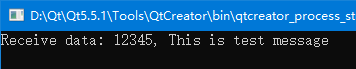
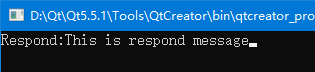

[TOC]

## 简介

***thrift*** 原来是facebook的rpc框架，根据数据结构和接口描述生成多种语言的接口，方便使用多种语言进行开发，详细信息这里不再赘述，下文以一个简单的代码（C++）示例来介绍使用方法。

示例使用的版本信息：

thrift：0.10.0

boost：1.61.0

Qt：MinGW5.5.1

## thrift数据结构

不同的语言的数据结构大体相同，但是也有细微的区别，不能通用，thrift使用自己特有的语法描述需要接口，使用指定工具生成对应语言的接口。

thrift的数据结构如下：

```c++
//基本类型
bool：布尔型，4位
byte：带符号整数，8位
i16	：带符号整数，18位
i32	：带符号整数，32位
i64	：带符号整数，64位
double：64位浮点型
string：UTF-8编码的字符串
//特殊类型
binary：未经编码的字节流
//结构体
struct：公共对象，不能继承
struct test{
	1: string name
}
//枚举
enum test{
	OK = 0,
	Fail = 1
}
//容器
list：	有序列表
set:	 无需集合
map:	 映射数据
//异常类型
exception：
//服务类型
service：对应服务的类
```

## 使用简介

### 1、编写thrift脚本

thrift脚本用于描述接口

```c++
//文件名：test.thrift
//请求数据结构
struct SendData{
	1: i32 id,
	2: string message
}
//返回数据结构
struct RespondData{
	1:string message
}
//收发服务类名Service和接口RespondData
service Service{
	RespondData dataSend(1: SendData s),
}
```

### 2、编译脚本

使用thrift工具编译脚本

```cmake
./thrift-0.10.0.exe -r --gen cpp test.thrift
```

完成后，在目录下生成 ***gen-cpp*** 目录，生成的指定语言的接口代码，其中，***xxx_server.skeleton.cpp*** 中为程序入口。

### 3、在工程中使用thrift

为了方便跨平台，使用Qt框架。

#### （1）服务端

新建工程，将生成的所有文件加到工程中

此时构建一定失败的，尤其是一大推的 ***文件不存在*** 或者 ***undefined reference to*** 错误：

1. 使用 ***thrift*** 必须会用到其依赖的 ***boost***，使用相同的编译器编译 ***boost***，将头文件和库文件加到工程中（boost具体该如何编译，请自行参考相关文章）；
2. 将用到的 ***thrift*** 的文件加到工程中，注意不需要全部（thrift的依赖库不仅仅是boost，还有其他的，如libevent/openssl等，但不是必须的，用不到的功能可以不用添加，省事）；

编译完成后，服务端基本完成，修改接口方法：

我们设定的接口方法 ***dataSend***，找到对应的接口（一般在main函数上面），修改

```c++
void dataSend(RespondData& _return, const SendData& s) {
    // Your implementation goes here
    printf("Receive data: %d, %s\n", s.id, s.message.c_str());//打印客户端的传入参数
    _return.message = "This is respond message";//返回给客户端的数据
  }
```
主入口代码不变：
```c++
int main(int argc, char **argv) {
    int port = 9090;//服务端监听的端口
    shared_ptr<ServiceHandler> handler(new ServiceHandler());
    shared_ptr<TProcessor> processor(new ServiceProcessor(handler));
    shared_ptr<TServerTransport> serverTransport(new TServerSocket(port));
    shared_ptr<TTransportFactory> transportFactory(new TBufferedTransportFactory());
    shared_ptr<TProtocolFactory> protocolFactory(new TBinaryProtocolFactory());

    //创建server，这样会单线程执行，同一时间只能接收一次请求，可以使用多线程
    TSimpleServer server(processor, serverTransport, transportFactory, protocolFactory);
    server.serve();
    return 0;
}
```

#### （2）客户端

新建工程，将接口代码添加到项目中，除了 ***xxx_server.skeleton.cpp***，这里面是服务端的代码

添加代码和相应的类库，和服务端类似

```c++
#include "gen-cpp/Service.h"
#include <thrift/transport/TSocket.h>
#include <thrift/transport/TBufferTransports.h>
#include <thrift/protocol/TBinaryProtocol.h>
using namespace apache::thrift;
using namespace apache::thrift::protocol;
using namespace apache::thrift::transport;

using boost::shared_ptr;

int main(int argc, char **argv) {
    //创建socket，接口要和服务端一致，thrift本质上还是socket，这里使用socket短链接
    boost::shared_ptr<TSocket> socket(new TSocket("localhost", 9090));
    boost::shared_ptr<TTransport> transport(new TBufferedTransport(socket));
    //传输协议
    boost::shared_ptr<TProtocol> protocol(new TBinaryProtocol(transport));
    transport->open();//开始传输，最后要关闭

    //发送数据结构
    SendData send_data;
    send_data.__set_id(12345);
    send_data.__set_message("This is test message");
    ServiceClient client(protocol);//创建客户端

    //响应数据结构
    RespondData respond_data;
    client.dataSend(respond_data, send_data);//开始交互
    printf("Respond:%s", respond_data.message.c_str());

    transport->close();
    return 0;
}
```

#### （3）运行

最后，运行结果如下

服务端：



客户端：



自此，使用 ***thrift*** 完成一次数据交互，从代码中可以看到，客户端/服务端像调用函数一样进行数据交互，这就是RPC的方便所在。

## 错误集锦

windows下没有PosixThreadFactory类，可以使用BoostThreadFactory代替