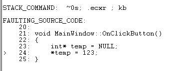
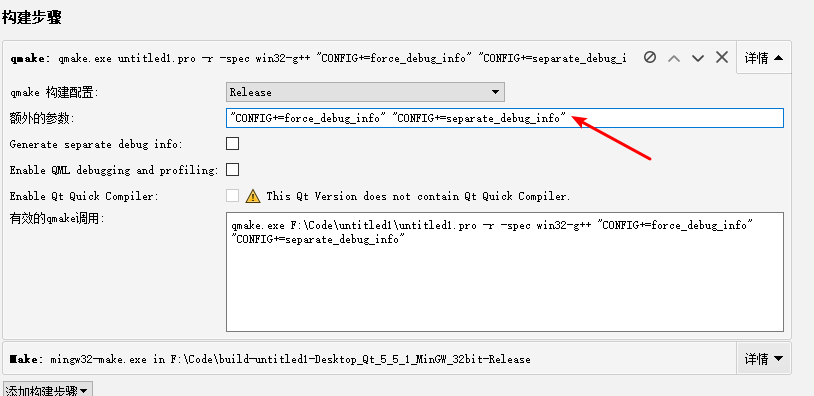

# windbg

**windbg** 是windows下调试工具，结合pdb和dump文件，可以定位到崩溃的源码

windows下最常用的编译器主要是gcc和msvc，使用的方式不同。而msvc作为微软主打的编译器，在调试方面有着先天的优势，可以不需要windbg，直接使用VS调试即可，所以，这里主要介绍在gcc编译器下，如何定位崩溃代码，当然，msvc编译器下的使用方式也会简单介绍

使用 **windbg** 调试需要dump和pdb文件

# 在MinGW套件下的使用方式

**环境：**windows 10、MinGW

**工具：**QtCreator、cv2pdb、windbg

## 1、生成pdb

mingw下不会生成pdb，文件，所以，这里需要使用 **cv2pdb** 来转换，github地址：https://github.com/rainers/cv2pdb

当然，使用 **cv2pdb** 是有条件的，需要在pro文件中添加如下代码：

```cmake
#加入调试信息
QMAKE_CFLAGS_RELEASE += -g
QMAKE_CXXFLAGS_RELEASE += -g
#禁止优化
QMAKE_CFLAGS_RELEASE -= -O2
QMAKE_CXXFLAGS_RELEASE -= -O2
#release在最后link时默认有"-s”参数，表示"Omit all symbol information from the output file"，因此要去掉该参??QMAKE_LFLAGS_RELEASE = -mthreads -Wl,
QMAKE_LFLAGS_RELEASE = -mthreads -Wl,
```

这里需要注意的是，**wl** 后面有一个逗号，缺了它，构建会失败

构建完成之后，可以使用 **cv2pdb** 工具生成pdb文件了，指令如下，参数为可执行文件：

```cmake
cvpdb.exe test.exe
```

## 2、生成dump

windows平台下，可以使用windows API **MiniDumpWriteDump** 实现dump文件的生成，代码如下：

```cmake
LIBS += -lDbgHelp
```

```c++
#include<Windows.h>
#include<DbgHelp.h>
// 创建Dump文件
void CreateDumpFile(LPCWSTR lpstrDumpFilePathName, EXCEPTION_POINTERS *pException)
{
    HANDLE hDumpFile = CreateFile(lpstrDumpFilePathName, GENERIC_WRITE, 0, NULL, CREATE_ALWAYS, FILE_ATTRIBUTE_NORMAL, NULL);
    // Dump信息
    MINIDUMP_EXCEPTION_INFORMATION dumpInfo;
    dumpInfo.ExceptionPointers = pException;
    dumpInfo.ThreadId = GetCurrentThreadId();
    dumpInfo.ClientPointers = TRUE;
    // 写入Dump文件内容
    MiniDumpWriteDump(GetCurrentProcess(), GetCurrentProcessId(), hDumpFile, MiniDumpNormal, &dumpInfo, NULL, NULL);
    CloseHandle(hDumpFile);
}
// 处理Unhandled Exception的回调函数
LONG ApplicationCrashHandler(EXCEPTION_POINTERS *pException)
{
    CreateDumpFile(L"Test.dmp",pException);
    return EXCEPTION_EXECUTE_HANDLER;
}
```
使用 **SetUnhandledExceptionFilter** 方法设置崩溃拦截方法，添加回调函数：
```c++
SetUnhandledExceptionFilter((LPTOP_LEVEL_EXCEPTION_FILTER)ApplicationCrashHandler);
```

如上代码，在运行过程中崩溃就会执行指定的回调函数，生成dump

## 3、测试代码

多余代码忽略，这里只上崩溃时的代码

```c++
void MainWindow::OnClickButton()
{
    int* temp = NULL;
    *temp = 123;
}
```

## 4、使用windbg调试

这时候，已经存在dump和pdb文件了，打开windbg.exe工具并进行以下设置：

1. **File -> Symbol File Path** 添加pdb文件的路径；
2. **File -> Source File Path** 添加源代码路径，一般是main入口文件的路径；
3. **File -> Open Crash Dump** 添加崩溃生成的dump文件；
4. 输入指令 **!analyze -v** 开始分析，**BUSY** 表示正在分析中，等待一会，则会生成堆栈内容；

分析结果很多，这里只截取其中一部分，如下图，定位到了崩溃的代码：



# 在MSVC编译器下

msvc编译器下调试则会方便许多

**环境：**windows 10、msvc2015

**工具：**QtCreator、windbg

## 1、生成pdb文件

在编译构建时添加额外的参数：

```cmake
"CONFIG+=force_debug_info" "CONFIG+=separate_debug_info"
```



编译完成之后，则会生成pdb文件

## 2、其他步骤

剩下的步骤和在MinGW下相同，生成dump，可以使用windbg调试，也可以使用VS调试