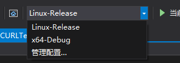

# 一、说明

有些时候，我们需要在 Linux 上调试c++代码，过去的做法是使用 SSH 远程登陆，使用 vim 编辑，指令行调试，这样做费时费力，难度较大，而VS在2017版本及其之后包含了远程调试的功能，可以大大提高生产力。

想要视同VS的远程调试功能，在安装的时候需要勾选 C++ for Linux选项

实际上，VS的远程开发调试也是使用SSH，只不过加了一层界面，方便开发

本文以VS2019为例，介绍使用方法

# 二、C++ for Linux

创建项目的时候选择C++ for Linux，并在工具-选项-跨平台中添加远程服务器的配置，如下：

开发构建的时候用选择配置的平台即可

# 三、使用cmake远程调试

VS默认的for Linux 项目使用的是 g++ 编译器直接编译，而大多数项目使用的是cmake工具集，g++则显得及其不方便项目的迁移，下面介绍VS中使用cmake远程开发调试

开始前，远程平台上需要安装相对应的环境，cmake、make、g++等，这里跳过不提

首先，创建cmake工程，并编写相关文件，忽略不说，主要在远程配置一段

右击项目列表中的 CMakeLists.txt 文件，选择，xxxx的 CMake 设置，则会在当前目录下生成 CMakeSettings.json 文件，其用于保存远程调试的一些配置，且VS提供了界面去修改该文件，当然也可以手动修改文件。

一般默认的项目是x64-Debug，我们添加远程的配置即可，点击配置下面的绿色的加号，添加项目平台

在出现的平台列表中选择 Linux环境

这样就创建了一个新的构建平台，随后，就可以修改相关的配置了，这里只介绍一些简单且必须的配置

远程计算机选择需要ssh链接的 Linux 平台

工具集选择linux_x64

远程生成根则是项目上传到远程平台的路径，默认在.vs目录下

点击高级选项，配置一下远程平台的 cmake 工具的路径

到此，项目的基本配置完成，还有一些其他的，比如cmake参数等，也可以配置，但不是必须的

# 四、项目的构建

配置完成之后，在配置工具中选择添加的平台配置来切换平台

随后，只要我们修改保存 CMakeLists.txt 文件，则VS会自动将项目上传，右击 CMakeLists.txt 选择，为 xxxx生成缓存，则会执行cmake指令，生成Makefile

点击菜单栏-生成-全部生成，则会同步代码，并执行make指令构建。VS 中这里有一个问题，不知道算不算BUG，如果能顺利构建成功，则VS会完成构建，并提示生成成功，但是如果，项目有问题，无法成功构建，则VS会一直卡在构建的步骤上，不会提示错误。

至此，构建成功之后，标签切换到main() 方法所在的文件，就可以使用调试功能了，调试输出的内容会在Linux控制台窗口中出现，可以在菜单栏-调试-Linux控制台窗口 中打开

# 五、总结

其实总体来说，VS只是一款高级的工具，想要用的顺手，除了多熟悉之外，还要熟悉项目的构建方式，比如cmake、make、gcc指令等，只有能够使用命令行构建项目，才能更好地使用工具代码手动敲命令

