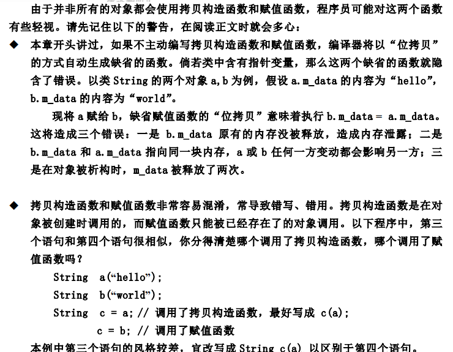

# 1、简介

C++ 在对象的拷贝过程中，如果没有自定义 **拷贝构造函数**，系统会提供一个缺省的 **拷贝构造函数**；

# 2、缺省的拷贝构造函数的拷贝方式：

- 对基本类型的成员变量，按照字节复制；
- 对于类类型的成员变量，调用相应类型的拷贝构造函数；

# 3、何时会调用拷贝构造函数

- 对象以值传递的方式进入函数体（函数参数没有特殊修饰都是值传递）；
- 函数体内，在栈区定义的对象，作为函数返回值；
- 使用另一个对象进行初始化；

**示例：**

```c++
class A{} //类A  
//param_a为值传递传入，函数参数压栈时，调用A的拷贝构造函数构造一个新的A对象 
A Function(A param_a){ 
    A a;    
    return a; 
}
//函数返回的是对象a的拷贝，即调用函数返回出来的A对象，是调用A的拷贝构造函数，构造出来的一个对象，不是a  
A a_1; 
A a_2(a_1); //这里使用对象a_1构造对象a_2，则会调用A的拷贝构造函数 
```

# 4、深拷贝和浅拷贝

**浅拷贝**

- 缺省的拷贝构造函数就是浅拷贝；
- 位拷贝、赋值重载均是；
- 对象指针，则拷贝指针的指向，而不是指向内存的内容，会导致两个对象的公用某个内存；

**深拷贝**

- 自定义深拷贝，构造自己的资源，尤其是指针上；

# 5、浅拷贝可能导致的问题

下图来自《高质量的c c++编程》



意思很明确，缺省的 **拷贝构造函数** 只会单调地去拷贝变量的数据，而不关心数据到底是什么；

如果成员变量是指针，则缺省的拷贝构造函数也是只拷贝指针的数据，即指针指向的地址，所以，就是出现这么一种情况，原始对象和新对象的共用了某段内存，这样可能会出现三种错误：

1. 新对象的指针如果已经申请了内存，则此指针被重新指向，则原来的内存没有释放，导致内存泄漏；
2. 两个对象的某个指针指向同一段内存，一个对象改动会影响另一个对象；（利用这个特性，也可以实现一些功能）
3. 对象被析构时，两个对象会导致同一段内存被释放两次；

**综上，如果对象中没有指针（成员对象往下迭代也没有指针），则没有深拷贝也不会有什么问题**

# 6、拷贝和赋值

如4中所说的，尽量在写代码的时候，区分调用拷贝构造函数，或者赋值函数

比如：
```c++
String c; c = a; 
```
上面的写法是调用了赋值函数
```c++
String c = a; 
```
上面的写法，虽然是使用 **=**，但是，却是使用的拷贝构造函数，如果能写成下面的写法，看代码时会更加明确
```c++
String c(a); 
```
这是一个好的编码习惯，但不是强制性的

另外，如果能同时将 **拷贝构造函数** 和 **赋值函数** 都自定义出来，上面两种写法其实都不会有影响