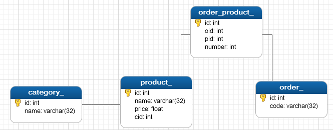

[TOC]

## 说明

操作数据库需要 ***sql*** 语句以及 ***connection***、***statement*** 、***resultset*** 等，对于不同的表，代码雷同，繁琐且枯燥。

***Mybatis*** 通过 ***xml*** 配置之后，只需要提供 ***sql*** 语句即可，避免了重复繁琐的工作。

## 示例

### 需求说明：

1. 有 ***Product***、***Category*** 和 ***Order*** 三种数据，实现对三种数据的数据库 ***CRUD*** 操作；
2. ***Product*** 有 ***id*** 、 ***name*** 和 ***price*** 属性；
3. ***Category*** 有 ***id*** 和 ***name*** 属性；
4. ***Order*** 有 ***id*** 和 ***code*** 属性；
5.  一个 ***Product*** 只能属于一个 ***Category***，多个 ***Product*** 可以属于同一个 ***Category***；
6. 一个 ***Product*** 可以包含在多个 ***Order*** 中，一个 ***Order*** 也可以包含多个 ***Product***；
7. 完成模糊查询；

### 需求分析：

使用 ***Mybatis*** 需要先手动创建数据库和 ***table***。

***order*** 和 ***product*** 之间是多对多的关系，则需使用额外的映射表 ***order_product\_*** 来映射。

数据库 ***ER*** 图如下所示：



### 代码结构：

1. ***mybatis-config.xml***，***Mybatis*** 的数据库配置文件，使用时需要加载此文件；
2. ***Category.java***，***category*** 的实体类，包含属性以及 ***setter/getter***；
3. ***Category.xml***，和 ***Category.java*** 同级目录（位于 ***src*** 目录下即可，可以在配置文件中配置，最好和实体类放在一起），作为实体类和数据库的映射关系；
4. ***Product.java***，***product*** 的实体类；
5. ***Product.xml***，映射配置文件；
6. ***Order.java***，***order*** 的实体类；
7. ***OrderMapper.java***，映射关系类；
8. ***Order.xml***，映射配置文件；
9. ***TestMybatis.java***，测试类；

### 代码：

#### （1）mybatis-config.xml

```xml
<?xml version="1.0" encoding="UTF-8"?>
<!DOCTYPE configuration
PUBLIC "-//mybatis.org//DTD Config 3.0//EN"
"http://mybatis.org/dtd/mybatis-3-config.dtd">

<configuration>
    <typeAliases>
        <package name="com.how2java.pojo"/>
    </typeAliases>
    <environments default="development">
        <environment id="development">
            <transactionManager type="JDBC"/>
            <dataSource type="POOLED">
                <property name="driver" value="com.mysql.jdbc.Driver"/>
                <property name="url" value="jdbc:mysql://127.0.0.1:3306/mybatis?characterEncoding=UTF-8"/>
                <property name="username" value="root"/>
                <property name="password" value=""/>
            </dataSource>
        </environment>
    </environments>
    <mappers>
        <mapper resource="com/how2java/pojo/Category.xml"/>
        <mapper resource="com/how2java/pojo/Product.xml"/>
        <mapper resource="com/how2java/pojo/Order.xml"/>
        <mapper resource="com/how2java/pojo/OrderMapper.xml"/>
    </mappers>
</configuration>
```

**说明：**

```xml
<typeAliases>
	<package name="com.how2java.pojo"/>
</typeAliases>
```

类型别名，在实体类和数据库映射的时候，需要指定 ***type***，输入类型全路径，比如：

```xml
<typeAliases>
    <typeAlias alias="user" type="com.how2java.pojo.User"/>
    <typeAlias alias="str" type="java.lang.String"/>
</typeAliases>
```

后面再有 ***type***，直接使用别名 ***user*** 和 ***str*** 代替即可。

而这里的代码是批量定义别名，在 ***bean*** 很多的时候，一个一个定义别名就很麻烦了，批量定义别名即在 ***name*** 上加上包名即可，包下的所有类自动加上别名，默认的别名是类名的首字母变成小写，比如 ***com.how2java.pojo.User*** 别名是 ***user***。

```xml
<environments default="mysql">
	<environment id="mysql">
        ...
    </environment>
    <environment id="oracle">
        ...
    </environment>
</environments>
```

数据库环境配置，***envirments*** 下可以配置多个数据库环境，然后指定某一个。

```xml
<transactionManager type="JDBC"/>
```

指定事务管理类型，这里是简答的的 ***JDBC*** 的提交和回滚设置

```xml
<dataSource type="POOLED">
	<property name="driver" value="com.mysql.jdbc.Driver"/>
	<property name="url" value="jdbc:mysql://127.0.0.1:3306/mybatis?characterEncoding=UTF-8"/>
	<property name="username" value="root"/>
	<property name="password" value=""/>
</dataSource>
```

***dataSource*** 指连接源配置，***Mybatis*** 推荐使用数据源来管理数据路连接，即维持着一个连接池，而不用每次连接都开启一个连接，***POOLED*** 是 ***JDBC*** 连接对象的数据源连接池的实现

```xml
<mappers>
	<mapper resource="com/how2java/pojo/Category.xml"/>
	<mapper resource="com/how2java/pojo/Product.xml"/>
</mappers>
```

告诉 ***Mybatis*** 去哪里找持久化类的映射文件。

#### （2）Category.java

略

#### （3）Category.xml

```xml
<?xml version="1.0" encoding="UTF-8"?>
<!DOCTYPE mapper
    PUBLIC "-//mybatis.org//DTD Mapper 3.0//EN"
    "http://mybatis.org/dtd/mybatis-3-mapper.dtd">

<mapper namespace="com.how2java.pojo">
    <select id="listCategory" resultType="Category">
        select * from category_      
    </select>
    <insert id="addCategory" parameterType="Category">
        insert into category_ (name) value (#{name})
    </insert>
    <delete id="deleteCategory" parameterType="Category">
        delete from category_ where name=#{name}
    </delete>
    <select id="getCategory" parameterType="_int" resultType="Category">   
        select * from category_ where id=#{id}    
    </select>
    <update id="updateCategory" parameterType="Category">
        update category_ set name=#{name} where id=#{id}
    </update>
    <select id="selectByName" parameterType="string" resultType="Category">
        select * from category_ where name like concat('%',#{0},'%')
    </select>
    <select id="selectByIdAndName" parameterType="map" resultType="Category">
        select * from category_ where id > #{id} and name like concat('%', #{name}, '%')
    </select>
    
    <resultMap type="Category" id="categoryBean">
        <id column="cid" property="id"/>
        <result column="cname" property="name"/>
        <collection property="products" ofType="Product">
            <id column="id" property="id" />
            <result column="pname" property="name"/>
            <result column="price" property="price"/>
        </collection>
    </resultMap>
    <select id="one2ManyListCategory" resultMap="categoryBean">
        select c.id 'cid', c.name 'cname', p.id 'id', p.name 'pname', p.price 'price' from category_ c inner join product_ p on c.id=p.cid;
    </select>
</mapper>
```

**说明：**

- ***namespace*** 可以是包名，也可以是包名 + 映射文件，可以保证名称的唯一；
- ***id*** 用户在调用 ***sql*** 语句时使用；
- ***parameterType*** ：传入参数类型；
- ***resultType***：返回结果类型；
- 一对多/多对一的时候，就需要使用 ***resultMap*** 标签，***resultMap*** 的 ***type*** 属性必填；
  - ***resultMap*** 的 ***id*** 在使用其时指定；
  - ***resultMap*** 内存入结果值，需要的属性则接入，不需要的不加；
  - ***id*** 属性使用 ***id*** 标签，其他通用类型属性使用 ***result*** 标签，自定义属性使用 ***collection/association*** 标签；
  - ***property*** 为属性名， ***column*** 作为属性注入的名称，用在 ***sql*** 语句中；
  - ***colection*** 为对多时使用，即结果是一个集合，***ofType*** 指的是集合里面的数据的数据类型，***javaType*** 指的是次属性的数据类型，这里是 ***java.util.ArrayList / list*** ，因为是默认，所以省略了；
  - ***association*** 为对一时使用，即结果是一个属性，所以没有 ***ofType***，只有 ***javaType***；
- ***sql*** 语句里使用单引号注入结果；
- ***sql*** 语句里可以使用 ***#{ }*** 使用参数传入，若传入的是类，则也可以使用带有 ***getter*** 的属性；

#### （4）Product.java

略

#### （5）Product.xml

```xml
<?xml version="1.0" encoding="UTF-8"?>
<!DOCTYPE mapper
    PUBLIC "-//mybatis.org//DTD Mapper 3.0//EN"
    "http://mybatis.org/dtd/mybatis-3-mapper.dtd">
    
<mapper namespace="com.how2java.pojo">
    <select id="listProduct" resultType="Product">
        select * from product_
    </select>
    <resultMap type="Product" id="productBean">
        <id column="pid" property="id" />
        <result column="pname" property="name"/>
        <result column="price" property="price" />
        <association property="category" javaType="Category">
            <id column="cid" property="id"/>
            <result column="cname" property="name"/>
        </association>
    </resultMap>
    <select id="listProduct2" resultMap="productBean">
        select p.id 'pid', p.name 'pname', p.price 'price', c.id 'cid', c.name 'cname' 
        from product_ p inner join category_ c on p.cid=c.id; 
    </select>
</mapper>
```

#### （6）Order.java

略

#### （7）OrderMapper.java

```java
public class OrderMapper {
    private int id;
    private int number;
    private Order order;
    private Product product;
    //getter/sette略
}
```

#### （8）Order.xml

```xml
<?xml version="1.0" encoding="UTF-8"?>
<!DOCTYPE mapper
    PUBLIC "-//mybatis.org//DTD Mapper 3.0//EN"
    "http://mybatis.org/dtd/mybatis-3-mapper.dtd">
    
<mapper namespace="com.how2java.pojo.Order">
    <resultMap type="order" id="orderBean">
        <id column="order_id" property="id"/>
        <result column="order_code" property="code" />
        <collection property="orderMappers" ofType="OrderMapper">
            <id column="order_mapper_id" property="id"/>
            <result column="order_mapper_number" property="number" />
            <association property="product" javaType="Product">
                <id column="product_id" property="id" />
                <result column="product_name" property="name"/>
                <result column="product_price" property="price"/>
            </association>
        </collection>
    </resultMap>
    <select id="listOrder" resultMap="orderBean">
        select od.id 'order_id', od.code 'ordercode', 
        op.id 'order_mapper_id', op.number 'order_mapper_number', 
        p.id 'product_id', p.name 'product_name', p.price 'product_price'
        from order_ od inner join order_product_ op on od.id=op.oid 
        inner join product_ p on op.pid=p.id;
    </select>
</mapper>
```

**说明：**

这是典型的多对多模式，多对多其实也就是一对多和多对一的叠加而已。

- 搜索结果返回的类型是 ***Order***；
- ***Order*** 里可能包含很多 ***Product***，这里可以用 ***Product***，但是却用了 ***OrderMapper***，看似多此一举，但是却方便维护，若以后再添加其他映射，会方便很多；
- 这里的 ***collection*** 里面还有 ***association***，是因为结果的 ***OrderMapper*** 里面还有还有自定义的 ***Product***；
- 这里有些属性不需要，就没有添加进去，因为有些属性（比如 ***id***）是相等的；

#### （9）TestMybatis.java

```java
InputStream inputStream = Resources.getResourceAsStream("mybatis-config.xml");
SqlSessionFactory sqlSessionFactory = new SqlSessionFactoryBuilder().build(inputStream);
SqlSession sqlSession = sqlSessionFactory.openSession();
doSomeThing();
sqlSession.commit();
sqlSession.close();
```

**说明：**

- 读取配置文件；
- 通过 ***SqlSession*** 对象来；
- 执行数据库操作；
- 提交事务，关闭 ***SqlSession***；

**不传参：**

```java
List<Category> categories = sqlSession.selectList("listCategory");
```
**传递map类型参数**：

```java
Map<String, Object> paramsMap = new HashMap<>();
paramsMap.put("id", 0);
paramsMap.put("name", "c");
List<Category> categories = sqlSession.selectList("selectByIdAndName", paramsMap);
```

**传递自定义类型参数**：

```java
Map<String, Object> paramsMap = new HashMap<>();
paramsMap.put("id", 0);
paramsMap.put("name", "c");
List<Category> categories = sqlSession.selectList("selectByIdAndName", paramsMap);
```

