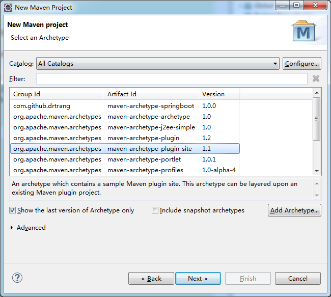
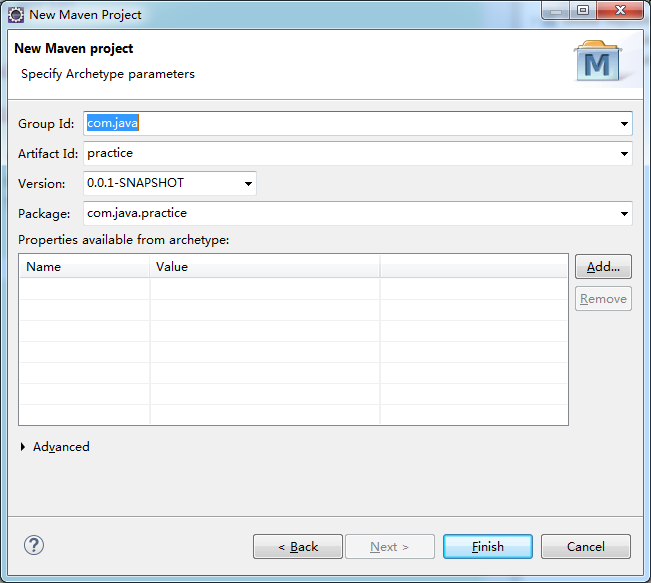
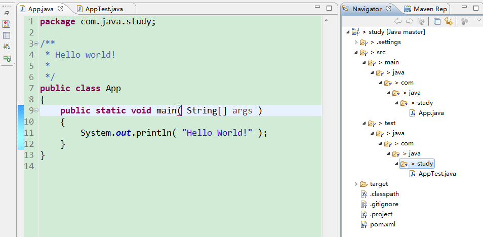
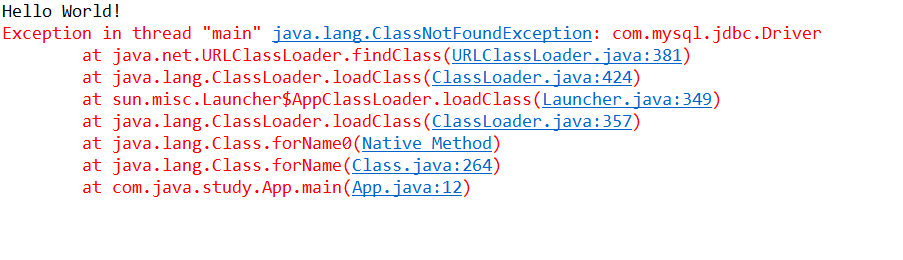
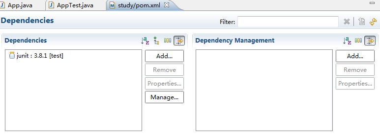
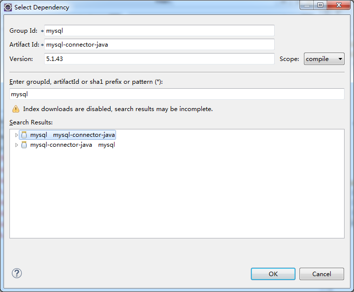
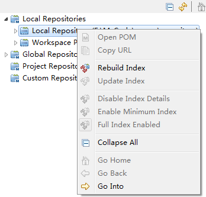
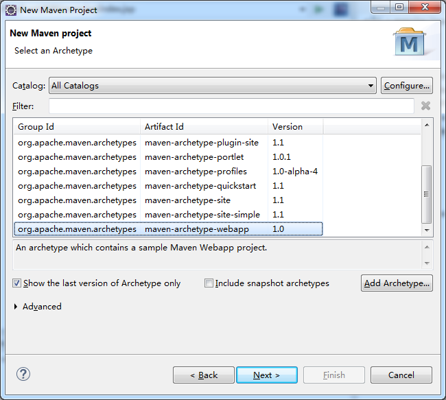

[TOC]

# 在Eclipse中创建项目

## 1 创建简单项目

创建项目，类型选择 ***Maven Project***，下图使用默认选项 ***maven-archetype-quickstart***，下一步



填写项目信息，天下Group Id和Artifact Id后，Package会生成对应的包路径，这里即main入口，自动生成一个Hello World：



完成后，如下：



直接运行即可

## 2 项目结构分析

参考上图的项目结构

1. ***pom.xml*** 用于维护当前项目的jar包；
2. ***src/main/java*** 下面是java代码
3. ***src/test/java*** 下面是测试代码

## 3 添加jar包

本次添加mysql的jar包

修改项目代码：

```java
public class App 
{
    public static void main( String[] args ) throws ClassNotFoundException
    {
        Class.forName("com.mysql.jdbc.Driver");
        System.out.println("Init pass");
    }
}
```

运行，提示缺少相应的包：



如2中所说，***pom.xml*** 负责维护当前项目的jar包，Eclipse 内置了pom的解析器，不需要手动修改内容，有GUI。双击打开pom.xml文件，进入 ***Dependencies*** 页面



可见，当前项目只有一个junit的包，这只maven默认自带的，这时，只需要在这里添加需要的mysql包即可

点击Add，输入mysql，出现仓库中的mysql的jar包，选择，保存，确定即可



## 4 重建本地仓库

添加包的时候，没有在仓库中搜索到响应的包，这时候，重建本地仓库即可

注：重建仓库需要时间，点击Rebuild后，等待右下角进度条结束完成才可

Window->Show View->Other->Maven->Maven Repositories



## 5 在Eclipse中创建web项目

与创建Maven普通项目类似，在选择 ***archetype*** 时，指定webapp即可，如下：



创建完成后可直接运行

### 5.1 创建源码目录

若发现生成的项目结构中没有源码的目录，则可以在Java Build Path中手动指定JDK版本即可

