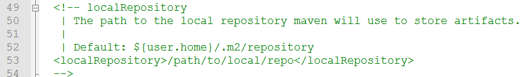
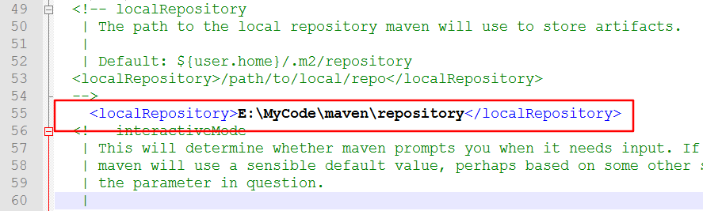
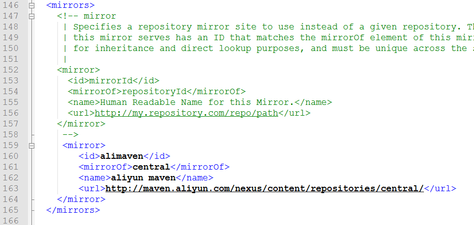
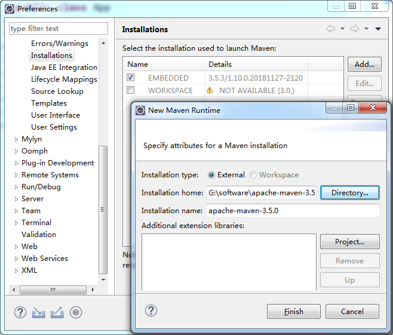
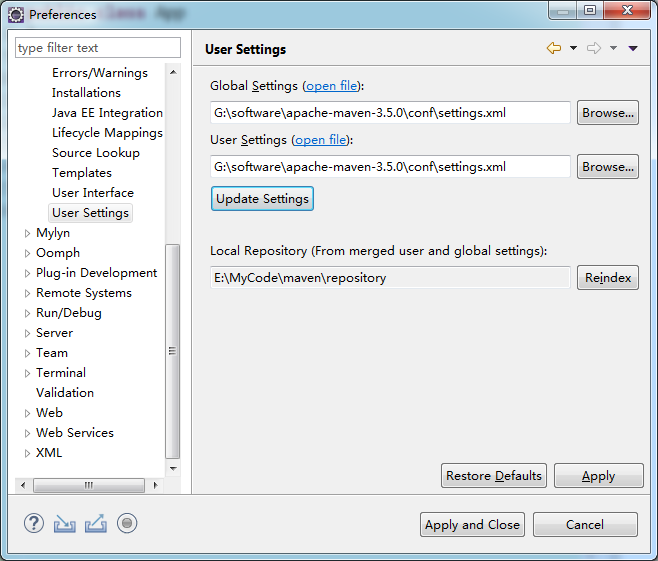

[TOC]

## 1 简介

- 用于构建和管理Java的项目的工具；

### 1.1 优点：

1. 统一维护jar包 - 多个Java项目可能用到相同的jar包，使用Maven仓库，方便管理共享包；
2. 相同的项目结构 - 多个Java项目的结构相同，方便维护

## 2 安装和配置

1. 官网下载包：apache-maven-xxx-bin.zip，解压后将目录下的 **bin文件夹** 添加到 **系统环境变量** 中；
2. 添加完成后，使用 **mvn -v** 即可查看版本；

**注：安装路径上不能出现空格**

## 3 仓库

- 用于存放项目需要的jar包；
- 一个仓库，多个项目共用；

### 3.1 仓库位置

#### 3.1.1 默认位置

打开安装目录下**conf** 文件夹下的 ***setting.xml*** 文件，约第52行，指定位置：

即：`C:\Users\sherlock\.m2\repository` 目录

#### 3.1.2 自定义仓库位置

在默认位置下，新增`localRepository`

如下图所示：



### 3.2 下载路径

***maven*** 默认从官方的服务器下载jar包，因为不可说的原因，速度很慢

为了方便，改成国内阿里云的镜像

同样是 ***setting.xml*** 文件，在 ***mirrors*** 内新增镜像即可，如下：



```xml
<mirror>
    <id>alimaven</id>
    <mirrorOf>central</mirrorOf>
    <name>aliyun maven</name>
    <url>
        http://maven.aliyun.com/nexus/content/repositories/central/
    </url>
</mirror>
```

## 4 使用指令行创建Maven风格的项目

略

## 5 Eclipse中Maven的配置

Eclipse EE版本已经继承了Maven

### 5.1 设置Maven的路径

Window -> Preferences -> Maven -> Installations，指定maven的安装路径，并勾选



### 5.2 设置仓库路径

1. Window -> Preferences -> Maven -> User Settings下，Global Settings和User Settings都是用setting.xml文件；
2. 改完后，点击 Update Settings，下方会出现仓库路径，点击Reindex 即可完成



