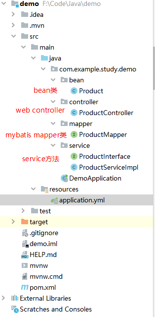
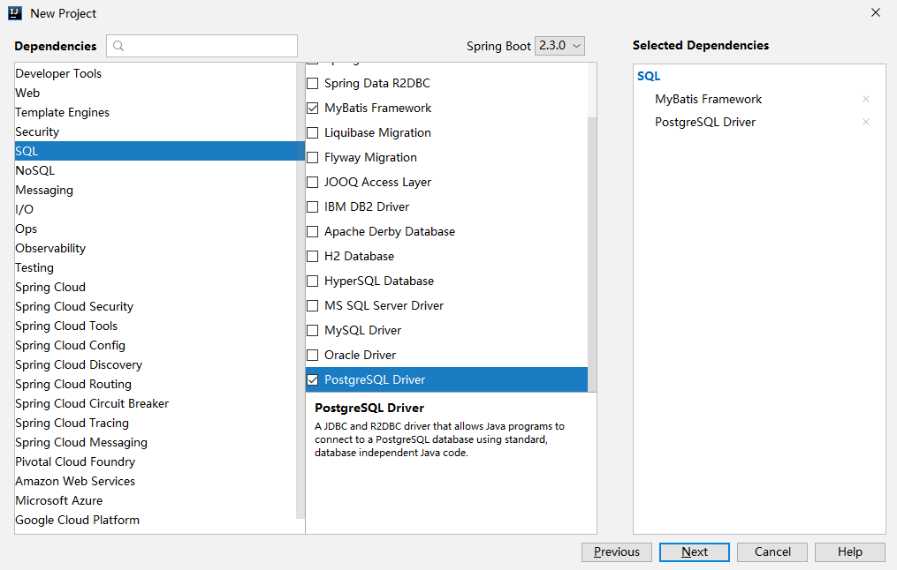

# 1、说明

MyBatis 不需要多说，它是Java的一个ORM框架，本文主要介绍如何在springboot中整合Mybatis，需要说明的是，本文只是一个最基本的整合，不涉及一些复杂的操作，而且一直是说明如何做，而不是为什么这么做，可以说只是一个学习的初级阶段，还有很多用法知识点需要深入学习

# 2、环境工具

操作系统：windows 10

IDE：IDEA

数据库：postgresql

# 3、整合方式

最终的项目目录如下：



- **bean** 包内是数据库表的映射类，类成员和表字段一一对应，DAO层，有人也称dao包；
- **controller** 不用多说，是web项目的接口；
- **mapper** 包内是 mybatis的 mapper 映射，要把包路径配置到项目中，最终操作数据库考的就是此包内的类；
- **service** 包内是 service 层的方法，不消细说；

其实，这几个包和MyBatis相关的也就 bean 和 mapper 包了；

项目整合 MyBatis 的步骤如下：

## 3.1、数据库环境准备

安装配置数据的方式不提，保证可访问

新建数据库study，并新建表 product 表示商品，字段有：

- **id**，主键，自增；
- **name**，商品名称，字符串；
- **price**，商品价格，浮点型；
- **count**，商品数量，整型；

## 3.2、添加MyBatis依赖

springboot中添加依赖的方式就是pom.xml文件，至于添加MyBatis依赖，可以在使用springboot模板创建工程的时候，勾选MyBatis项目即可完成添加，如下图：



注意这里添加的是MayBatis和数据库的依赖，项目创建完成后，添加的依赖会在pm.xml文件体现

当然，最直接的方法是直接修改 pom.xml 依赖文件

```xml
<dependencies>
	<!-- springboot web项目依赖 -->
	<dependency>
		<groupId>org.springframework.boot</groupId>
		<artifactId>spring-boot-starter-web</artifactId>
	</dependency>
	<!-- mybatis依赖 -->
	<dependency>
		<groupId>org.mybatis.spring.boot</groupId>
		<artifactId>mybatis-spring-boot-starter</artifactId>
		<version>2.1.2</version>
	</dependency>
	<!-- pg -->
	<dependency>
		<groupId>org.postgresql</groupId>
		<artifactId>postgresql</artifactId>
		<version>42.2.2</version>
	</dependency>
</dependencies>
```

## 3.3、修改配置文件

```yml
server:
  port: 8081
spring:
  datasource:
    url: jdbc:postgresql://192.168.2.118:5432/study
    username: postgres
    password: postgres
    driver-class-name: org.postgresql.Driver
mybatis:
  type-aliases-package: com.example.study.demo.mapper
```

这里的说明不消细说

**type-aliases-package** 表示 MyBatis 的 mapper 的包路径，当然也可以使用 **@MapperScan** 注解写在入口类上

## 3.3、添加bean类

bean 类需要和数据库表一一对应，根据表结构创建 bean 类如下：

```java
public class Product {
    private Integer id;
    private String name;
    private Double price;
    private Integer count;

	//getter和setter略
}
```

## 3.4、添加mapper接口

mapper 真正实现的功能是通过 mybatis 实现数据库的 crud

```java
@Mapper
public interface ProductMapper {

    @Insert("insert into product(name, price, count)values(#{name},#{price},#{count})")
    int insert(Product product);

    @Delete("delete from product where name=#{name}")
    int deleteProductByName(String name);

    @Update("update product set name=#{name}, price=#{price}, count=#{count} where id=#{id}")
    int updateProductById(Product product);

    @Select("select id, name, price, count from product where price between #{lowLimit} and #{upperLimit}")
    List<Product> getProductByPriceLimit(double lowLimit, double upperLimit);
}
```

**说明：**

- 这是一个接口类；

- **@mapper** 注解从mybatis3.4.0之后加入，从此以后，不用在写蛋疼的 mapper 的映射文件；
- **@Insert** / **@Delete** / **@Update** / **@Select** 对应一些数据库的操作，不需要细说

到此，其实本文已经可以结束了，MyBatis 相关的东西都在这里，只要使用 ProductMapper 对象即可实现操作，接下来的代码都是 MVC 层次的东西，不进行详细说明，如有需要，可参考相应的文章

## 3.5、service层

```java
public interface ProductInterface {

    int addProduct(Product product);

    int deleteProduct(String name);

    int updateProductById(Product product);

    List<Product> getProductByLimt(Double lowLimit, Double upperLimit);
}
```


```java
@Service
public class ProductServiceImpl implements ProductInterface {

    @Autowired
    private ProductMapper productMapper;

    @Override
    public int addProduct(Product product) {
        return productMapper.insert(product);
    }

    @Override
    public int deleteProduct(String name) {
        return productMapper.deleteProductByName(name);
    }

    @Override
    public int updateProductById(Product product) {
        return productMapper.updateProductById(product);
    }

    @Override
    public List<Product> getProductByLimt(Double lowLimit, Double upperLimit) {
        return productMapper.getProductByPriceLimit(lowLimit, upperLimit);
    }
}
```

## 3.6、controller层

```java
@RestController
public class ProductController {

    @Autowired
    private ProductInterface productServer;

    @RequestMapping(value = "/add")
    public String addProduct(){
        Product product = new Product();
        product.setName("1#商品");
        product.setPrice(12.34);
        product.setCount(100);

        int res = productServer.addProduct(product);
        return String.format("添加商品OK，结果：%d", res);
    }

    @RequestMapping(value = "/get")
    public String get(){
        List<Product> productList = productServer.getProductByLimt(0.1, 100.0);
        return String.format("获取商品数量为：%d", productList.size());
    }

}
```

## 3.7、测试

输入URL 127.0.0.1:8081/add 和 127.0.0.1:8081/get，调试查看运行状态即可

# 4、小结

写该文的时候，对springboot 的了解还不够深入，只是对一些东西知其然，并不知其所以然，也就是一个 **Tourist** ，即旅行者的角色，当然这并不说我有什么错，这是学习的毕竟之路，目前要做的是，针对Java的 springboot 框架及其周边生态的学习，尽量都达到旅行者的角色状态。在此之后，才是 **Resident**，即居住者

从  **Tourist**  的角度回顾这些东西，有些感悟

因为以前都是基于C++的开发，对于数据库的交互都是需要自己封装一个数据库操作类，根据需要拼接数据库，进行操作，难度不大，但是着实繁杂。

而学习了Java及其生态之后，才发现框架应用的存在就是把这些繁杂的东西给简化了，让你能只关注业务的部分

这算是一大收获把


