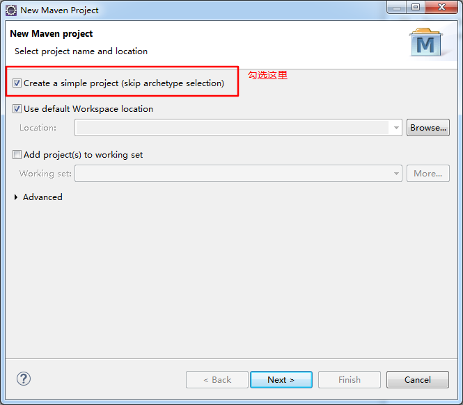
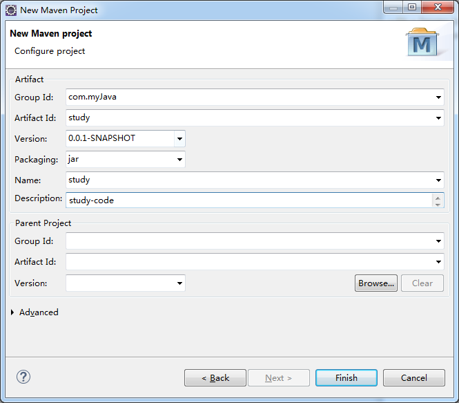
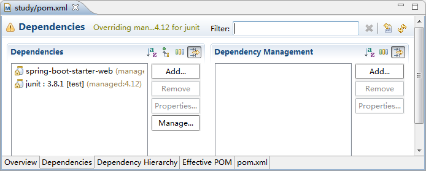
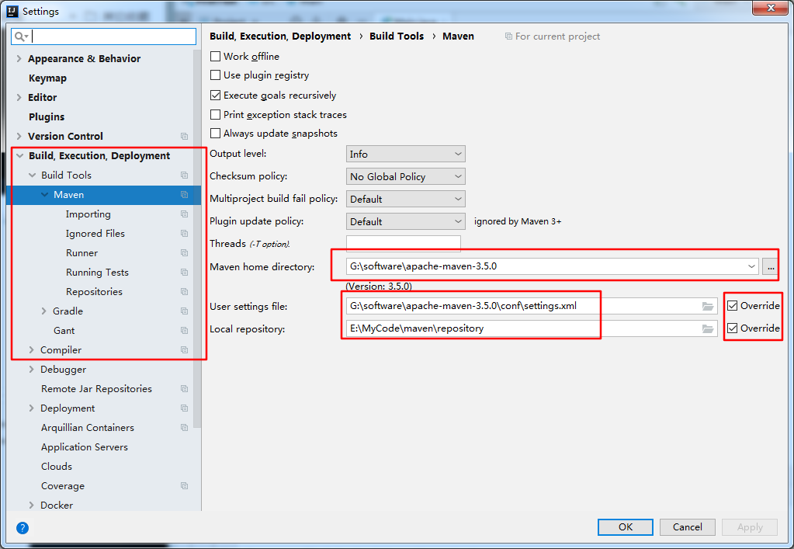
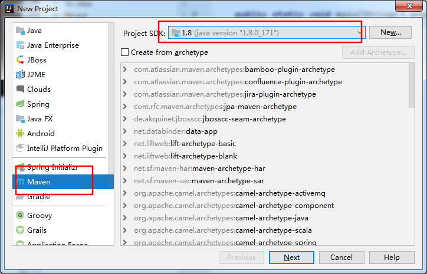
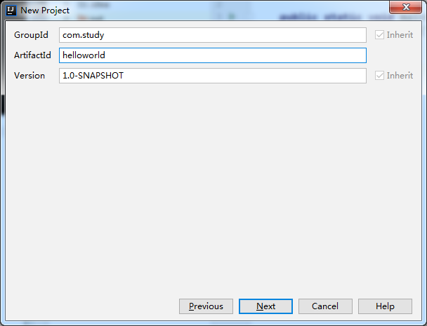
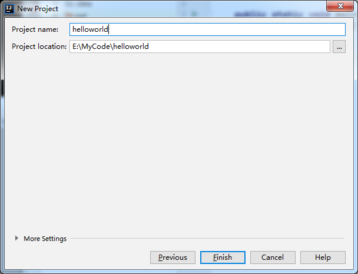
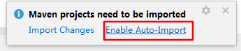

[TOC]

# 微服务

- 区别于单体应用；

- 一种架构风格，将一个大型工程拆分成一组小型服务；
- 每个服务均有自己的进程，通过http方式通信互调；

**缺点：**

- 服务过多，不利于运维和开发；

**解决方法：**

​	**Spring Boot + Spring Cloud + Spring Cloud Data Flow**

# 创建SpringBoot项目

## 1. 在Eclipse中创建项目

### 1.1 创建项目

File -> New -> Other -> Maven -> Maven -> Maven Project -> New Maven Project





### 1.2 加载第三方jar包

修改pom.xml文件，加上需要的包



最终xml的内容如下：

```xml
<project xmlns="http://maven.apache.org/POM/4.0.0" xmlns:xsi="http://www.w3.org/2001/XMLSchema-instance" xsi:schemaLocation="http://maven.apache.org/POM/4.0.0 http://maven.apache.org/xsd/maven-4.0.0.xsd">
  <modelVersion>4.0.0</modelVersion>
  <groupId>com.myJava</groupId>
  <artifactId>study</artifactId>
  <version>0.0.1-SNAPSHOT</version>
  <name>study</name>
  <description>study-code</description>

	<parent>
		<groupId>org.springframework.boot</groupId>
		<artifactId>spring-boot-starter-parent</artifactId>
		<version>1.5.9.RELEASE</version>
	</parent>
	<dependencies>
        <dependency>
            <groupId>org.springframework.boot</groupId>
            <artifactId>spring-boot-starter-web</artifactId>
        </dependency>
        <dependency>
              <groupId>junit</groupId>
              <artifactId>junit</artifactId>
              <version>3.8.1</version>
              <scope>test</scope>
        </dependency>
    </dependencies>
    <properties>
        <java.version>1.8</java.version>
    </properties>
 
    <build>
        <plugins>
            <plugin>
                <groupId>org.springframework.boot</groupId>
                <artifactId>spring-boot-maven-plugin</artifactId>
            </plugin>
        </plugins>
    </build>
</project>
```

### 1.3 创建入口

创建 ***Application.java***，代码如下：

```java
package com.myJava.study;

import org.springframework.boot.SpringApplication;
import org.springframework.boot.autoconfigure.SpringBootApplication;

@SpringBootApplication
public class Application {
    public static void main(String[] args) {
        SpringApplication.run(Application.class, args);
    }
}
```

**说明：**

1. 注解 ***@SpringBootApplication*** 表示这是一个**SprintBoot**应用，主方法启动**Tomcat**，默认端口8080；
2. 这是一个web程序，但是最后却不是像其他项目一样run on server，而是直接运行应用，就是因为 ***springboot.Application*** 类的主方法把 **Tomcat** 嵌入进去了，而不需要手动启动 **Tomcat**；

### 1.4 创建controller

代码如下：

```java
package com.myJava.study.web;

import org.springframework.web.bind.annotation.RequestMapping;
import org.springframework.web.bind.annotation.RestController;

@RestController
public class Controller {
    @RequestMapping("/hello")
    public String hello() {
        return "Hello, World";
    }
}
```

**说明：**

1. **@RestController** 是 **spring** 里的注解，为**@ResponseBody**和**@Controller**的缩写；

### 1.5 运行测试

运行Application.java，访问地址：**http://127.0.0.1:8080/hello**

效果如下，就是这么方便


## 2 在IDEA中创建项目


### 2.1 MAVEN环境

安装目录下：***conf/settings.xml*** 文件在 ***profiles*** 标签内新增 ***profile*** 标签

```xml
<profile>
	<id>jdk-1.8</id>
	<activation>
		<activeByDefault>true</activeByDefault>
		<jdk>1.8</jdk>
	</activation>
	<properties>
		<maven.compiler.source>1.8</maven.compiler.source>
		<maven.compiler.target>1.8</maven.compiler.target>							<maven.compiler.compilerVersion>1.8</maven.compiler.compilerVersion>
	</properties>
<profile>
```

### 2.2 IDEA设置

IDEA若不配置，则使用其默认的MAVEN，有以下几处需要自行配置：

1. Maven home directory，选择我们自己的MAVEN；
2. User settings file，选择我们自己的MAVEN的conf目录下的settings.xml文件；
3. Local reponsitory，仓库，作用之前的文章有介绍过；



### 2.3 创建jar工程







在提示的Maven需要导入的提示中，选择打开自动导入，以后，每次在pom.xml文件中添加依赖，IDEA则会自动下载并导入相关依赖包



### 2.4 导入依赖

在 ***pom.xml*** 中添加springboot的依赖

```xml
<parent>
	<groupId>org.springframework.boot</groupId>
	<artifactId>spring-boot-starter-parent</artifactId>
	<version>1.5.9.RELEASE</version>
</parent>
<dependencies>
	<dependency>
	<groupId>org.springframework.boot</groupId>
	<artifactId>spring-boot-starter-web</artifactId>
	</dependency>
</dependencies>
```

因为前面选择了自动导入，所以，这里添加后，IDEA会自动下载相关依赖包