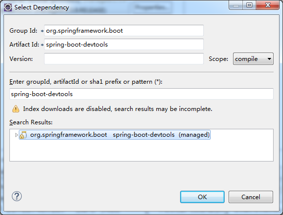
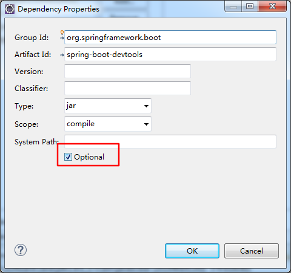

## 说明

- 热部署仅用于IDE中；
- 写完SpringBoot代码之后，启动 **Application** 类，若修改代码，则需要重新启动，热部署即是自动启动，不需要手动重启；

## 方法

再 ***pom.xml*** 中增加依赖 ***spring-boot-devtools*** 即可

以Eclipse为例，使用界面工具，修改：





xml内容如下：

```xml
<project xmlns="http://maven.apache.org/POM/4.0.0" xmlns:xsi="http://www.w3.org/2001/XMLSchema-instance" xsi:schemaLocation="http://maven.apache.org/POM/4.0.0 http://maven.apache.org/xsd/maven-4.0.0.xsd">
  <modelVersion>4.0.0</modelVersion>
  <groupId>com.myJava</groupId>
  <artifactId>study</artifactId>
  <version>0.0.1-SNAPSHOT</version>
  <name>study</name>
  <description>study-code</description>
  <packaging>war</packaging>
  
	<parent>
		<groupId>org.springframework.boot</groupId>
		<artifactId>spring-boot-starter-parent</artifactId>
		<version>1.5.9.RELEASE</version>
	</parent>
	<dependencies>
        <dependency>
            <groupId>org.springframework.boot</groupId>
            <artifactId>spring-boot-starter-web</artifactId>
        </dependency>
        <dependency>
              <groupId>junit</groupId>
              <artifactId>junit</artifactId>
              <version>3.8.1</version>
              <scope>test</scope>
        </dependency>
        <dependency>
        	<groupId>org.springframework.boot</groupId>
        	<artifactId>spring-boot-starter-tomcat</artifactId>
        	<scope>provided</scope>
        </dependency>
        <dependency>
        	<groupId>org.springframework.boot</groupId>
        	<artifactId>spring-boot-devtools</artifactId>
        	<optional>true</optional>
        </dependency>
	</dependencies>
    <properties>
        <java.version>1.8</java.version>
    </properties>
 
    <build>
        <plugins>
            <plugin>
                <groupId>org.springframework.boot</groupId>
                <artifactId>spring-boot-maven-plugin</artifactId>
            </plugin>
        </plugins>
    </build>
</project>
```

完成后，启动类 **Application**，修改代码后，IDE会自动重启

注：此热部署的方法不是每个JDK版本都适用