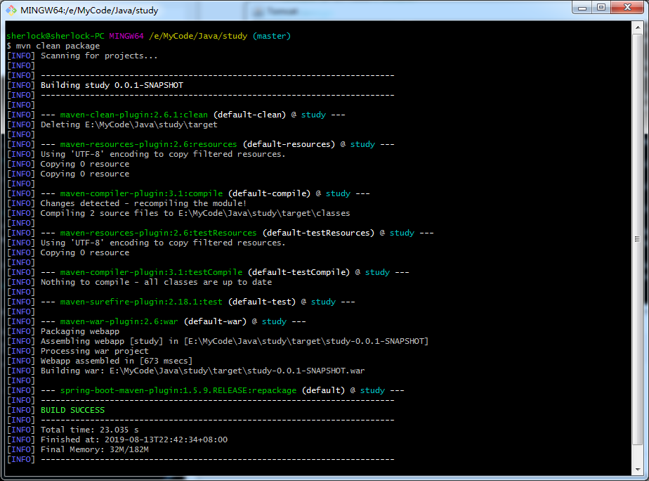

[TOC]

**记：**初学一门技术，不懂为什么没关系，先知道可以这样做，熟悉之后再去了解为什么这样做，如果刚开始就渗入追究原理，很容易打击自信心。

## 说明

- 不同于其他框架，都是将编译生成的class文件copy到**Tomcat**的目录下，运行**Tomcat**而启动；
- **SpringBoot**本质上还是一个应用程序，可以直接运行部署；

## 部署

部署方式有两种：

1. 将项目打包成一个jar，在服务器中运行；
2. 将项目打包成一个war；

### （1）jar方式部署

使用创建项目文章中的代码，代码在Eclipse中运行无误

**步骤1：**

打开项目所在的文件夹：


**步骤2：**

在项目目录中使用指令打包

```java
mvn install
```


打包完成后，在目录下的 ***target*** 目录下生成一个.jar文件：


**步骤3：**

将此.jar文件copy到服务器上，运行部署即可

```java
java -jar target/study-0.0.1-SNAPSHOT.jar
```


### （2）war方式

使用war的方式，就是将工程打包成.war文件，并放置于**Tomcat**的**webapps**目录下，通过容器来启动

**步骤1：**修改Application.class代码

修改部分：

1. 添加了***@ServletComponentScan*** 注解；
2. 继承自***SpringBootServletInitializer*** ；
3. 重载了***configure*** 方法；

```java
package com.myJava.study;

import org.springframework.boot.SpringApplication;
import org.springframework.boot.autoconfigure.SpringBootApplication;
import org.springframework.boot.builder.SpringApplicationBuilder;
import org.springframework.boot.web.servlet.ServletComponentScan;
import org.springframework.boot.web.support.SpringBootServletInitializer;

@SpringBootApplication
@ServletComponentScan
public class Application extends SpringBootServletInitializer{
    
    @Override
    protected SpringApplicationBuilder configure(SpringApplicationBuilder application) {
        return application.sources(Application.class);
    }
    
    public static void main(String[] args) {
        SpringApplication.run(Application.class, args);
    }
}
```

**步骤2：**修改pom.xml

修改部分：

1. 添加了 ***spring-boot-starter-tomcat*** 的依赖；
2. 添加了 ***\<packaging>war\</packaging>*** 打包声明，并将其修改为 ***provided*** 方式，避免和独立的***Tomcat*** 容器冲突；

**注：**provided 表示只在编译和测试的时候使用，打包的使用就没有用了

```xml
<project xmlns="http://maven.apache.org/POM/4.0.0" xmlns:xsi="http://www.w3.org/2001/XMLSchema-instance" xsi:schemaLocation="http://maven.apache.org/POM/4.0.0 http://maven.apache.org/xsd/maven-4.0.0.xsd">
  <modelVersion>4.0.0</modelVersion>
  <groupId>com.myJava</groupId>
  <artifactId>study</artifactId>
  <version>0.0.1-SNAPSHOT</version>
  <name>study</name>
  <description>study-code</description>
  <packaging>war</packaging>
  
	<parent>
		<groupId>org.springframework.boot</groupId>
		<artifactId>spring-boot-starter-parent</artifactId>
		<version>1.5.9.RELEASE</version>
	</parent>
	<dependencies>
        <dependency>
            <groupId>org.springframework.boot</groupId>
            <artifactId>spring-boot-starter-web</artifactId>
        </dependency>
        <dependency>
              <groupId>junit</groupId>
              <artifactId>junit</artifactId>
              <version>3.8.1</version>
              <scope>test</scope>
        </dependency>
        <dependency>
        	<groupId>org.springframework.boot</groupId>
        	<artifactId>spring-boot-starter-tomcat</artifactId>
        	<scope>provided</scope>
        </dependency>
	</dependencies>
    <properties>
        <java.version>1.8</java.version>
    </properties>
 
    <build>
        <plugins>
            <plugin>
                <groupId>org.springframework.boot</groupId>
                <artifactId>spring-boot-maven-plugin</artifactId>
            </plugin>
        </plugins>
    </build>
  
</project>
```

**步骤3：**打包

在项目的目录下，使用指令打包

```java
mvn clean package
```



1. 打包完成之后，在***Target*** 目录下生成 ***.war*** 打包文件;

2. 将其copy到 ***Tomcat*** 的目录下的 ***webapps*** 文件夹下，并重新命名，比如study；
3. 删除次目录下的ROOT文件夹；
4. 运行 ***Tomcat*** 目录下的 ***bin*** 文件夹下的 ***start.bat*** 来启动Tomcat；
5. 访问 ***http://127.0.0.1:8080/study/hello*** 即可看到效果；

**注：** 这里重命名，是因为名字最后要在url里面体现出来，自动生成的太长，无意义；但是这里的名字如果改成ROOT，就不需要在url里面加名字了，以为内ROOT表示根目录。

##  使用IDEA打包

在pom.xml中添加打包插件的依赖

```xml
<!--打包成jar的插件-->
<build>
	<plugins>
		<plugin>
			<groupId>org.springframework.boot</groupId>
			<artifactId>spring-boot-maven-plugin</artifactId>
		</plugin>
	</plugins>
</build>
```

然后打开 ***Maven*** 侧边栏，打开 ***Lifecycle***，运行 ***package***，完成后会在项目目录下的 ***target*** 目录下生成jar包

这其实和使用指令是一回事，只是IDEA帮我们封装好了而已

注意打包前要把运行的程序停止