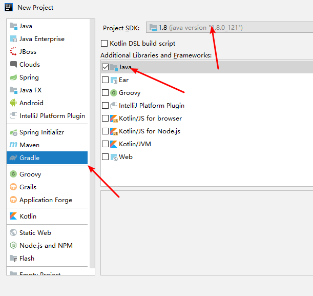
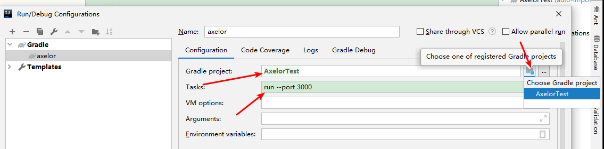
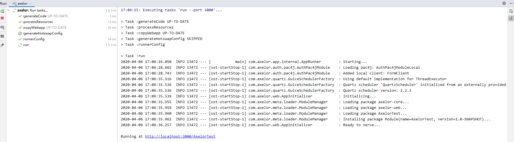
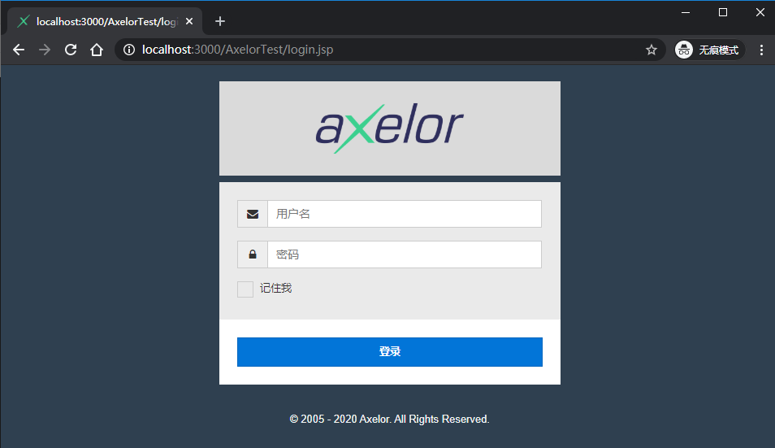
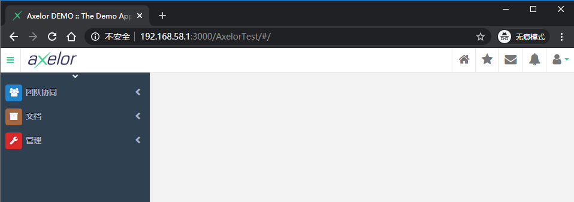

Axelor项目使用gradle来管理应用程序项目及其模块

# 1、目录结构

axelor最基本的项目目录结构如下：

```
open-platform-demo
└── src
│   └── main
│       ├── java
│       └── resources
│           ├── application.properties 
│           └── META-INF
│               └── persistence.xml 
├── gradle 
│   └── wrapper
│       ├── gradle-wrapper.jar
│       └── gradle-wrapper.properties
├── modules 
├── gradlew 
├── gradlew.bat 
├── settings.gradle 
└── build.gradle 
```

**说明：**

1. application.properties 是应用的配置文件
2. persistence.xml 是 JPA 配置文件
3. gradle 为 gradle 包装器目录，自动生成
4. modules 为模块目录
5. gradlew 和 gradlew.bat 分别为linux和windows系统下的包装器脚本，自动生成
6. settings.gradle 为gradle的配置脚本，自动生成
7. build.gradle 为axelor应用的gradle的构建脚本

# 2、axelor项目环境

本次基于IDEA创建，在创建之前需要保证以下的环境依赖都OK

1. Java 8，axelor 只支持Java 8；
2. gradle 构建工具，因为axelor用到了gradle的构建插件，所以只支持gradle；
3. IDE，本次使用IDEA；
4. 数据库，pg、mysql 和 Oracle都可以，本次使用pg；
5. 数据库客户端；

 # 3、axelor空项目骨架流程

1. 数据库创建用户，创建空库；
2. 新建一个基于 gradle 的 java 项目；
3. 按照 axelor 的 gradle 插件要求设置项目文件 build.gradle 和 settings.gradle；
4. 创建 application.properties 配置文件；
5. 创建 JPA 的 presistence.xml，这个一般是固定格式；
6. 在项目根目录创建 gradle.properties 文件，设置 gradle 编译运行参数，可选；
7. 启动运行，查看web界面；

# 4、创建项目

## 4.1、创建用户和空库

使用数据库工具创建用户，本次使用 axelor，密码也是axelor

创建空库，本次使用官网教程中的名称：open-platform-demo

## 4.2、创建基于gradle的java项目



后面的项目路径和名称随便填

项目创建好之后，可能跟第一节提到的目录结构差一点，差异的部分，自己创建即可

## 4.3、presistence.xml

该文件位于项目目录下 **src/main/resources/META-INF** 目录下，格式一般是固定的，我这里复制了别人项目中的内容

```xml
<?xml version="1.0" encoding="UTF-8" standalone="no"?>
<persistence version="2.1"
             xmlns="http://xmlns.jcp.org/xml/ns/persistence" xmlns:xsi="http://www.w3.org/2001/XMLSchema-instance"
             xsi:schemaLocation="http://xmlns.jcp.org/xml/ns/persistence http://xmlns.jcp.org/xml/ns/persistence/persistence_2_1.xsd">
    <persistence-unit name="persistenceUnit" transaction-type="RESOURCE_LOCAL">
        <provider>org.hibernate.jpa.HibernatePersistenceProvider</provider>
        <shared-cache-mode>ENABLE_SELECTIVE</shared-cache-mode>
        <properties>
            <!--
            <property name="javax.persistence.jdbc.driver" value="org.postgresql.Driver" />
            <property name="javax.persistence.jdbc.url" value="jdbc:postgresql://localhost:5432/axelor-app" />
            -->
            <property name="javax.persistence.jdbc.driver" value="org.hsqldb.jdbcDriver" />
            <property name="javax.persistence.jdbc.url" value="jdbc:hsqldb:mem:test" />

            <property name="javax.persistence.jdbc.user" value="sa" />
            <property name="javax.persistence.jdbc.password" value="" />

            <!-- value="create" to build a new database on each run;
                 value="update" to modify an existing database;
                 value="create-drop" means the same as "create" but also drops tables when Hibernate closes;
                 value="validate" makes no changes to the database -->
            <property name="hibernate.hbm2ddl.auto" value="update" />

            <!-- connection pooling -->
            <property name="hibernate.connection.provider_class"
                      value="org.hibernate.hikaricp.internal.HikariCPConnectionProvider" />

            <property name="hibernate.hikari.minimumIdle" value="10" />
            <property name="hibernate.hikari.maximumPoolSize" value="200" />
            <property name="hibernate.hikari.idleTimeout" value="30000" />
        </properties>
    </persistence-unit>
</persistence>
```

## 4.4、application.properties

该文件位于项目根目录下 **src/main/resources** 目录下，内容在官网上有具体说明

这里的配置如下：

```properties
# Application Information
# ~~~~~
application.name = Axelor DEMO
application.description = The Demo Application
application.version = 1.0.0

# Author/Company
# ~~~~~
application.author = Axelor
application.copyright = Copyright (c) {year} Axelor. All Rights Reserved.

# Header Logo
# ~~~~~
# Should be 40px in height with transparent background
application.logo =

# Home Website
# ~~~~~
# Link to be used with header logo
application.home = http://www.axelor.com

# Link to the online help
# ~~~~~
application.help = http://docs.axelor.com/adk

# Application deployment mode
# ~~~~~
# Set to 'dev' for development mode else 'prod'
application.mode = dev

# CSS Theme
# ~~~~~
# Set default CSS theme, for example `blue`
application.theme =

# Default Locale (language)
# ~~~~~
# Set default application locale (en, fr, fr_FR, en_US)
application.locale = zh_CN

# Encryption
# ~~~~~
# Set encryption password
#encryption.password = MySuperSecretKey

# Set encryption algorithm (CBC or GCM)
#encryption.algorithm = CBC

# Database settings
# ~~~~~
# See hibernate documentation for connection parameters

# PostgreSQL
db.default.driver = org.postgresql.Driver
db.default.ddl = update
db.default.url = jdbc:postgresql://192.168.2.118:5432/open-platform-demo
db.default.user = axelor
db.default.password = axelor

# MySQL
#db.default.driver = com.mysql.jdbc.Driver
#db.default.ddl = update
#db.default.url = jdbc:mysql://localhost:3306/axelor_demo_wip
#db.default.user = username
#db.default.password = secret

#db.default.driver = oracle.jdbc.OracleDriver
#db.default.ddl = update
#db.default.url = jdbc:oracle:thin:@localhost:1521:oracle
#db.default.user = username
#db.default.password =

# Date Format
# ~~~~~
date.format = yyyy/MM/dd

# Timezone
# ~~~~~
date.timezone = Asia/Shanghai

# Session timeout (in minutes)
# ~~~~~
session.timeout = 60

# Storage path for upload files (attachments)
# ~~~~~
# use {user.home} key to save files under user home directory, or
# use absolute path where server user have write permission.
file.upload.dir = {user.home}/.axelor/attachments

# Upload filename pattern, default is auto where file is save with same name
# in the given upload dir, if file is already there, a count number is
# appended to file name.
#
# This can be overridden by providing custom name pattern, for example:
#
#   file.upload.filename.pattern = {year}-{month}/{day}/{name}
#   file.upload.filename.pattern = {AA}/{name}
#
# Following placeholders can be used:
#
# {year} - current year
# {month} - current month
# {day} - current day
# {name} - file name
# {A} - first letter from file name
# {AA} - first 2 letter from file name
# {AAA} - first 3 letter from file name
#
#file.upload.filename.pattern = {year}-{month}/{day}/{name}

# Maximum upload size (in MB)
# ~~~~~
file.upload.size = 5

# Whitelist pattern can be used to allow file upload with matching names.
#
# For example: \\.(xml|html|jpg|png|pdf|xsl)$
#
# Regular expression
# ~~~~~
#file.upload.whitelist.pattern =

# Blacklist pattern can be used to block file upload with matching names.
#
# Regular expression
# ~~~~~
#file.upload.blacklist.pattern =

# Whitelist content type can be used to allow file upload with matching content.
#
# List of mime-types (plain/text,image/*,video/webm)
# ~~~~~
#file.upload.whitelist.types =

# Blacklist content type can be used to block file upload with matching content.
#
# List of mime-types (plain/text,image/*,video/webm)
# ~~~~~
#file.upload.blacklist.types =

# The external report design directory
# ~~~~~
# this directory is searched for the rptdesign files
# (fallbacks to designs provided by modules)
reports.design.dir = {user.home}/.axelor/reports

# Storage path for report outputs
reports.output.dir = {user.home}/.axelor/reports-gen

# Data export (csv) encoding
# ~~~~
# Use Windows-1252, ISO-8859-1 or ISO-8859-15 if targeting ms excel
# (excel does not recognize utf8 encoded csv)
data.export.encoding = UTF-8

# Storage path for export action
# ~~~~~
data.export.dir = {user.home}/.axelor/data-export

# Specify whether to import demo data
# ~~~~~
data.import.demo-data = true

# Storage path for templates
# ~~~~~
template.search.dir = {user.home}/.axelor/templates

# LDAP Configuration
# ~~~~~
#ldap.server.url = ldap://localhost:10389

# can be "simple" or "CRAM-MD5"
ldap.auth.type = simple

ldap.system.user = uid=admin,ou=system
ldap.system.password = secret

# group search base
ldap.group.base = ou=groups,dc=example,dc=com

# if set, create groups on ldap server under ldap.group.base
#ldap.group.object.class = groupOfUniqueNames

# a template to search groups by user login id
ldap.group.filter = (uniqueMember=uid={0})

# user search base
ldap.user.base = ou=users,dc=example,dc=com

# a template to search user by user login id
ldap.user.filter = (uid={0})

# CAS configuration
# ~~~~~
#auth.cas.server.url.prefix = https://localhost:8443/cas

# use public accessible url
#auth.cas.service = http://localhost:8080/open-platform-demo/cas

# login url, if not given prepared from server & service url
#auth.cas.login.url = https://localhost:8443/cas/login?service=http://localhost:8080/open-platform-demo/cas

# logout url, if not given prepared from server & service url
#auth.cas.logout.url = https://localhost:8443/cas/logout?service=http://localhost:8080/open-platform-demo/

# CAS validation protocol (CAS, SAML)
#auth.cas.protocol = SAML

# the attribute to map to user display name
#auth.cas.attrs.user.name = name

# the attribute to map to user email
#auth.cas.attrs.user.email = mail

# Quartz Scheduler
# ~~~~~
# quartz job scheduler

# Specify whether to enable quartz scheduler
quartz.enable = false

# total number of threads in quartz thread pool
# the number of jobs that can run simultaneously
quartz.threadCount = 3

# SMPT configuration
# ~~~~~
# SMTP server configuration
#mail.smtp.host = smtp.gmail.com
#mail.smtp.port = 587
#mail.smtp.channel = starttls
#mail.smtp.user = user@gmail.com
#mail.smtp.pass = secret

# timeout settings
#mail.smtp.timeout = 60000
#mail.smtp.connectionTimeout = 60000

# IMAP configuration
# ~~~~~
# IMAP server configuration
# (quartz scheduler should be enabled for fetching stream replies)
#mail.imap.host = imap.gmail.com
#mail.imap.port = 993
#mail.imap.channel = ssl
#mail.imap.user = user@gmail.com
#mail.imap.pass = secret

# timeout settings
#mail.imap.timeout = 60000
#mail.imap.connectionTimeout = 60000

# CORS configuration
# ~~~~~
# CORS settings to allow cross origin requests

# regular expression to test allowed origin or * to allow all (not recommended)
#cors.allow.origin = *
#cors.allow.credentials = true
#cors.allow.methods = GET,PUT,POST,DELETE,HEAD,OPTIONS
#cors.allow.headers = Origin,Accept,X-Requested-With,Content-Type,Access-Control-Request-Method,Access-Control-Request-Headers

# View configuration
# ~~~~~

# Set to true to enable single view mode
view.single.tab = false

# Set menu style (left, top, both)
view.menubar.location = both

view.toolbar.titles = true
# Set to false to hide advance search filter share option
#view.adv-search.share = true

# Logging
# ~~~~~
# Custom logback configuration can be provided with `logging.config` property pointing
# to a custom `logback.xml`. In this case, all the logging configuration provided here
# will be ignored.
#
# Following settings can be used to configure logging system automatically.
#
#logging.path = {user.home}/.axelor/logs
#logging.pattern.file = %d{yyyy-MM-dd HH:mm:ss.SSS} %5p ${PID:- } --- [%t] %-40.40logger{39} : %m%n
#logging.pattern.console = %clr(%d{yyyy-MM-dd HH:mm:ss.SSS}){faint} %clr(%5p) %clr(${PID:- }){magenta} %clr(---){faint} %clr([%15.15t]){faint} %clr(%-40.40logger{39}){cyan} %clr(:){faint} %m%n

# Global logging
logging.level.root = ERROR

# Axelor logging

# Log everything.
logging.level.com.axelor = INFO

# Hibernate logging

# Log everything. Good for troubleshooting
#logging.level.org.hibernate = INFO

# Log all SQL DML statements as they are executed
#logging.level.org.hibernate.SQL = DEBUG
#logging.level.org.hibernate.engine.jdbc = DEBUG

# Log all SQL DDL statements as they are executed
#logging.level.org.hibernate.tool.hbm2ddl = INFO

# Log all JDBC parameters
#logging.level.org.hibernate.type = ALL

# Log transactions
#logging.level.org.hibernate.transaction = DEBUG

# Log L2-Cache
#logging.level.org.hibernate.cache = DEBUG

# Log JDBC resource acquisition
#logging.level.org.hibernate.jdbc = TRACE
#logging.level.org.hibernate.service.jdbc = TRACE

# Log connection pooling
#logging.level.com.zaxxer.hikari = INFO
```

这里需要重点关注的有如下几个：

1. **application.name** 为应用的名称，根据需要填写；
2. **application.logo** 为背景logo，这里留空；
3. **application.locale** 为区域，这里改成 **zh_CN**，后面会加入汉化包；
4. **db.default.xxx** 就是数据库的配置，可以看到这里支持三种数据库，选择其中一种即可，配置数据库；
5. **date.format** 为时间格式，根据需要修改；
6. **date.timezone** 为时区，改成 **Asia/Shanghai**；
7. 在 **view.menubar.location** 下方新增 **view.toolbat.titles=true** 配置，这个是显示工具栏的文字；

这里的数据库需要注意，pg创建数据库后，会指定拥有者

## 4.5、build.gradle

清除 IDEA 默认生成内容，

```
buildscript {
    ext.repos = {
        // 这行放在上面，优先使用本地 `axelor-mvn-repo` 目录里提供的汉化过的 Axelor 框架
        maven {
            url uri("${projectDir}/axelor-mvn-repo")
        }


        // 最优先检查本地 Maven 仓库
        mavenLocal()

        // 公共仓库优先使用阿里云的
        maven { url 'https://maven.aliyun.com/repository/central' }
        maven { url 'https://maven.aliyun.com/repository/jcenter'}
        maven { url 'https://maven.aliyun.com/repository/gradle-plugin' }


        // 使用 Axelor 官方的 Repo 放在下面，以便补充缺少的 JAR
        maven { url 'https://repository.axelor.com/nexus/public/' }

        // 原始的 Maven 仓库放在最后，可以不用，因为阿里云的仓库是镜像同步的
        /*
        mavenCentral()
        jcenter()
        maven { url 'https://plugins.gradle.org/m2/'}
        */
    }
    repositories repos
    dependencies {
        classpath 'com.axelor:axelor-gradle:5.3.0-SNAPSHOT'
    }
}

allprojects {
    repositories repos
}

apply plugin: 'com.axelor.app'

axelor {
    title = 'Demo'
}

allprojects {
    apply plugin: 'idea'
    group 'study'
    version '1.0-SNAPSHOT'

    sourceCompatibility = 1.8
    targetCompatibility = 1.8
}

dependencies {
    //compile project(":modules:sales")
}
```

**说明：**

1. 可以看到 **buildscript** 内容和安装gradle配置镜像有点像，其实作用是相同的；

2. **ext.repos** 里面添加了一个额外的配置，是我们使用的汉化包，把汉化包copy到项目目录下，在这里配置路径即可；

3. **dependencies** 表示使用gradle插件；

4. **allprojects** 表示所有的项目都使用上面的配置；

5. **apply plugin** 表示启用 axelor.app 插件；

6. **axelor** 内的标题可以修改一下；

7. **allprojects** 内的group可以修改一下；

8. **dependencies** 是依赖的模块，因为本次是空项目，所以不需要模块；

## 4.6、settings.gradle

内容如下：

```
rootProject.name = 'AxelorTest'

//include "modules:sales"
```

IDEA会自动在此文件中帮我设定好rootProject

如果包含模块的话，需要在这里 **include** 模块目录，比如上面内容各种注释掉的 include，modules表所有模块的根目录，即第一节中目录结构中出现的那个modules，sales表示具体模块的目录

## 4.7、gradle.properties 

内容如下：

```
org.gradle.daemon=false
```

这个文件是可选的

## 4.8、运行

至此，一个空的 axelor 项目已经创建并配置完毕，接下来需要等待 IDEA 导入axelor的依赖结束。一般设置了自动导入的话，修改配置，则会自动导入，如果没有设置，则在IDEA的gradle的侧边栏中Reimport即可

添加运行参数，如下：



项目选择刚才创建的项目，任务填写run，后面可以指定端口以及其他参数等

运行项目，如下表示OK



打开链接，就能看到我们的axelor页面了



可以看到，这里的页面上已经汉化了，默认的系统用户和密码都是admin，登陆就可以看到内容

