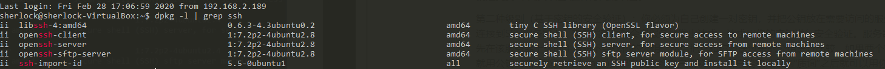
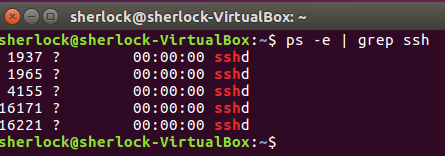

参考：https://blog.csdn.net/li528405176/article/details/82810342

# 一、说明

SSH，即 Secure Shell，它其实是一款协议，建立在应用层的基础之上，专门为远程登陆回话之用。

传统的FTP、Telnet本质上都是不安全的，因为它们使用明文传送数据、账号密码等，SSH协议采用非对称加密技术（RSA），对传输的数据进行加密，保证了安全性。

而且，SSH会对传输的数据进行压缩，可以加快传输效率。

目前，SSH已经成为了Liunx的标配

SSH只是一个协议，具体使用需要依赖工具，CentOS一般会默认安装OpenSSH，其他发行版的linux安装OpenSSH即可。

# 二、SSH的安全机制

但并不是说SSH就是绝对安全的，因为它本身提供两种级别的验证方法：

第一种级别（基于口令的安全验证）：只要你知道自己帐号和口令，就可以登录到远程主机。所有传输的数据都会被加密，但是不能保证你正在连接的服务器就是你想连接的服务器。可能会有别的服务器在冒充真正的服务器，也就是受到“中间人攻击”这种方式的攻击。

第二种级别（基于密钥的安全验证）：你必须为自己创建一对密钥，并把公钥放在需要访问的服务器上。如果你要连接到SSH服务器上，客户端软件就会向服务器发出请求，请求用你的密钥进行安全验证。服务器收到请求之后，先在该服务器上你的主目录下寻找你的公钥，然后把它和你发送过来的公钥进行比较。如果两个密钥一致，服务器就用公钥加密“质询”(challenge)并把它发送给客户端软件。客户端软件收到“质询”之后就可以用你的私钥在本地解密再把它发送给服务器完成登录。与第一种级别相比，第二种级别不仅加密所有传输的数据，也不需要在网络上传送口令，因此安全性更高，可以有效防止中间人攻击。

# 三、linux上的SSH

SSH分为客户端 openssh-client 和服务器 openssh-server，可以利用以下命令确认电脑上是否安装了客户端和服务器。

如下指令可以查看是否安装了SSH服务

```shell
dpkg -l | grep ssh
```
如下图，可以看到，SSH客户端和服务端都已经安装



通过以下指令，可以看到SSH服务是否已经开启

```shell
ps -e | grep ssh
```



其中，sshd表示 ssh-server已经启动

```shell
sudo /etc/init.d/ssh start 		#启动SSH server
sudo /etc/init.d/ssh stop  		#server停止ssh服务 
sudo /etc/init.d/ssh restart  	#server重启ssh服务
```


# 四、在linux上安装SSH

CentOS一般默认安装OpenSSH，ubuntu下使用apt指令安装即可，简单方便

```shell
sudo apt-get update
sudo apt-get install openssh-server
service ssh start
sudo ps -e|grep ssh
```

# 五、SSH两种级别的远程登陆

## 1、口令登陆

```shell
ssh sherlock@192.168.2.118
```

如果需要**调用图形界面程序**可以使用 **-X 选项**

```shell
ssh -X sherlock@192.168.2.118
```

如果客户机的用户名和服务器的**用户名相同**，登录时**可以省略**用户名

```shell
ssh 192.168.2.118
```

还要说明的是，SSH服务的**默认端口是22**，也就是说，如果你不设置端口的话登录请求会自动送到远程主机的22端口。我们可以使用 **-p 选项来修改端口号**，比如连接到服务器的1234端口

```shell
ssh -p 23 sherlock@192.168.2.118
```

我们可以通过 **Ctrl+D** 或者 **exit** 命令**退出远程登录**。

## 2、公钥登陆

每次登录远程主机都需要输入密码是很不方便的，如果想要省去这一步骤，可以利用密钥对进行连接，还可以提高安全性。

**在本机生成密钥对**

使用ssh-keygen命令生成密钥对：

```shell
ssh-keygen -t rsa   #-t表示类型选项，这里采用rsa加密算法
```


然后根据提示一步步的按enter键即可（其中有一个提示是要求设置私钥口令passphrase，不设置则为空，这里看心情吧，如果不放心私钥的安全可以设置一下），执行结束以后会在 /home/当前用户 目录下生成一个 .ssh 文件夹,其中包含私钥文件 id_rsa 和公钥文件 id_rsa.pub。

**将公钥复制到远程主机中**

使用ssh-copy-id命令将公钥复制到远程主机。ssh-copy-id会将公钥写到远程主机的 ~/ .ssh/authorized_key 文件中

```shell
ssh-copy-id ldz@192.168.0.1
```


经过以上两个步骤，以后再登录这个远程主机就不用再输入密码了。

# 六、SSH的高级应用
使用远程主机不中断的跑程序

当我们利用ssh在远程主机上跑程序的时候，只要关闭了终端就会中断ssh连接，然后远程主机上正在跑的程序或者服务就会自动停止运行。我们可以利用 nohup + 需要运行的程序 使运行的程序在切断ssh连接的时候仍然能够继续在远程主机中运行。nohup即no hang up(不挂起)。

除此之外还有很多远程操作应用，包括 数据传输、端口操作(将不加密的网络连接绑定到ssh端口实现间接加密) 等等，可以参考柚子皮大神的博客：https://blog.csdn.net/pipisorry/article/details/52269785