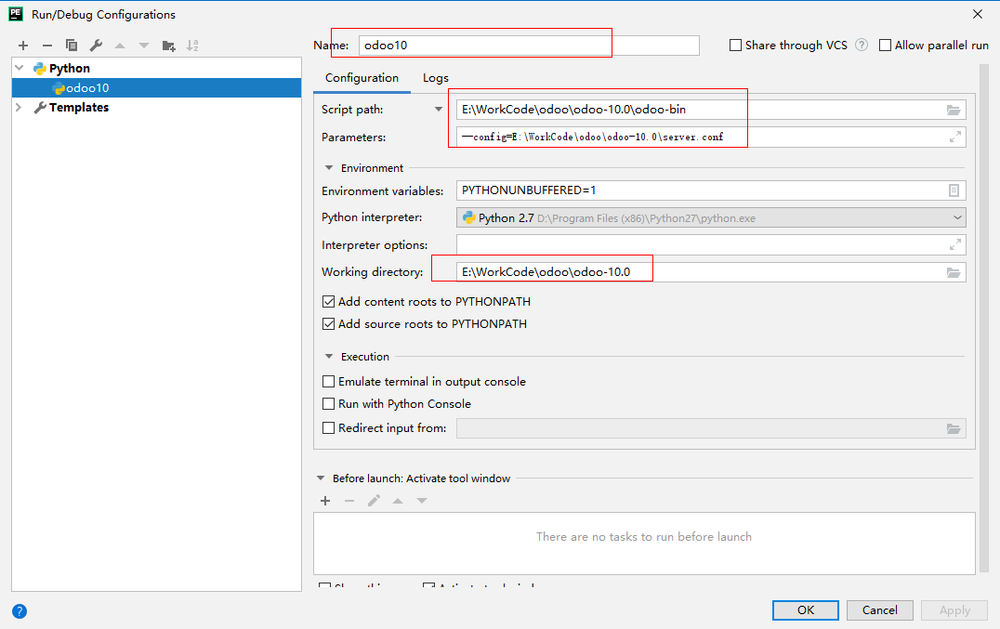
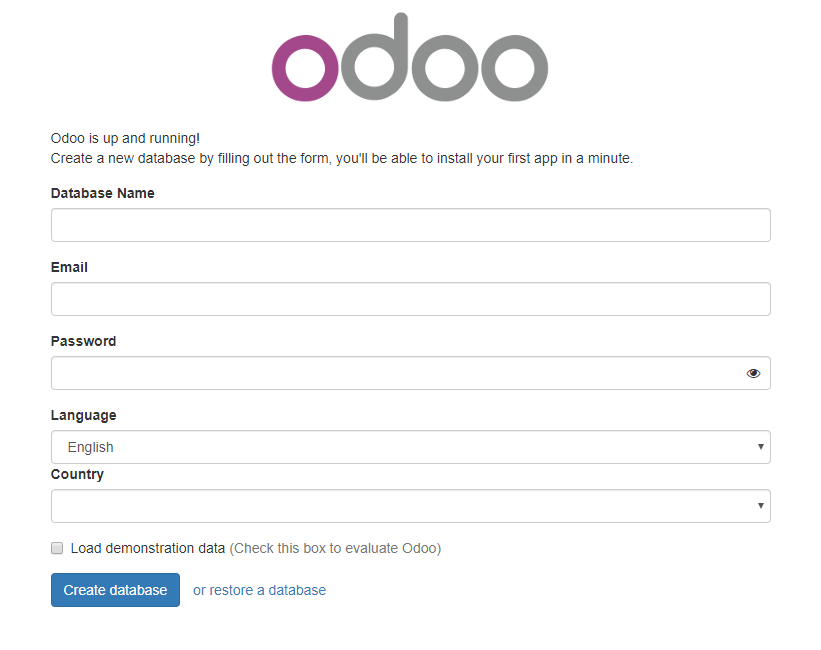

> 参考：https://www.jianshu.com/p/b4b46fc11c74

本文记载了odoo的安装过程，以及在安装时遇到的一些问题

# 一、安装版本

**操作系统：** windows10

**Python IDE：** PyCharm

**Python版本：** python2.7

**PostgreSql版本：** PostgreSQL 10.4, compiled by Visual C++ build 1800, 32-bit

**odoo源码：** odoo-10.0

# 二、odoo依赖

## 1、安装依赖

- odoo的使用依赖很多库，使用前需要全部安装；
- odoo目前仅支持python2；

odoo的依赖库均在源码目录下的 **requirements.txt** 文件内，在源码目录下执行指令 **pip install -r requirements.txt** 即可安装以来库，安装需要一些时间

## 2、安装依赖时出现的问题

windows系统下，安装odoo的依赖总是会出现一系列问题

### （1）VC++依赖

报错信息： ***Microsoft Visual C++ 9.0 is required (Unable to find vcvarsall.bat)***

原因：需要安装vs2008及其更高的版本

解决：下载安装即可（[http://www.microsoft.com/en-us/download/details.aspx?id=44266](https://link.jianshu.com/?t=http://www.microsoft.com/en-us/download/details.aspx?id=44266)）

### （2）pywin32报错

报错信息：***ImportError: No module named win32service***

原因：需要安装pywin32

解决：下载安装即可（[http://sourceforge.net/projects/pywin32/files/pywin32/Build%20219/](https://link.jianshu.com/?t=http://sourceforge.net/projects/pywin32/files/pywin32/Build 219/)）

### （3）64位python下安装依赖失败

解决方法：单独下载**whl** 文件安装即可（https://www.lfd.uci.edu/~gohlke/pythonlibs/），哪个依赖安装失败就单独下载安装哪个依赖

使用 **pip install xxxx.whl** 指令安装

# 三、运行源码

## 1、新建配置文件

使用 **pycharm** 打开源码目录，并在源码目录下新建文件 **server.conf**，文件名称随意

在配置文件中加入以下内容：

```ini
[options]
#服务器
db_host=localhost
#数据库用户名
db_user=odoo
#数据库密码
db_password=postgres
#数据库端口，默认5432
db_port=5432
#addons_path指向源码路径下的addons文件
addons_path=E:/WorkCode/odoo/odoo-10.0/addons
```

## 2、修改pycharm的运行配置



## 3、运行

保存配置，运行即可

## 4、打开页面

在浏览器中打开页面 http://127.0.0.1:8069/



# 四、常见问题

## 1、postgresql数据库

错误描述：**Using the database user 'postgres' is a security risk, aborting**

原因：配置的postgresql的用户权限太大，不能直接连接，可以新建一个用户，限制一些权限，配置进odoo的配置文件中

## 2、找不到模块

错误描述：

```
2017-01-05 06:38:51,046 5480 INFO ? odoo: database: odoo@localhost:5432
2017-01-05 06:38:51,049 5480 CRITICAL ? odoo.modules.module: Couldn't load module web
2017-01-05 06:38:51,049 5480 CRITICAL ? odoo.modules.module: No module named web
2017-01-05 06:38:51,049 5480 ERROR ? odoo.service.server: Failed to load server-wide module `web`.
The `web` module is provided by the addons found in the `openerp-web` project.
Maybe you forgot to add those addons in your addons_path configuration.
```

原因：配置文件中的 **addons_path** 配置错误，检查该路径，addons文件夹是源码根目录下的

## 3、页面看不到样式

解决方法：安装node.js和less

node.js和npm安装跳过

```
npm install -g less
```

