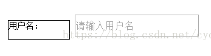

参考文章：https://blog.csdn.net/cyqzy/article/details/80973155

## 问题描述

`<span>`和`<input>`元素布局在同一行时，出现两个元素的高度出现偏差

## 示例

```html
<div class="gdpy">
   <span>用户名：</span>
   <input type="text" placeholder="请输入用户名">
</div>
```

### 效果：



### 说明：

无论如何布局，`<input>`元素都会偏移一些

### 原因：

由上图可以看出来，原因是，元素以文字的基线对齐的

## 解决方法

1. 给其中一个元素设置样式： **vertical-align: top**；
2. 使用 **float** 浮动；
3. 使用 **postion** 定位；