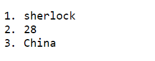

**用于遍历**

**需要以`site in sites`/`(site, key, index) in sites`的语法形式来使用；**

#### （1）绑定数组

```html
<div id="app">
    <ol v-for="message in messages">
        <li>{{ message }}</li>
    </ol>
</div>
```

```js
new Vue({
    el: '#app',
    data: {
        messages: [
            name, age, address
        ]
    }
});
```

#### （2）迭代对象

- 迭代对象中的所有数据

```html
<div id="app">
    <ol>
        <li v-for="message in objects">{{ message }}</li>
    </ol>
</div>
```

```js
new Vue({
    el:'#app',
    data: {
        objects: {
            name: "sherlock",
            age: 28,
            address: "China"
        }
    }
});
```
输出结果如下：



#### （3）添加索引

```html
<div id="app">
    <ol>
        <li v-for="(message, key, index) in objects">
            {{ message }}.{{key}}.{index}
        </li>
    </ol>
</div>
```

```js
new Vue({
    el:'#app',
    data: {
        objects: {
            name: "sherlock",
            age: 28,
            address: "China"
        }
    }
});
```

- `key`和`index`为可选参数；

#### （4）迭代整数

```html
<div id="app">
	<ul>
        <li v-for="value in 5">{{ value }}</li>
    </ul>
</div>
```

```js
new Vue({
    el: '#app'
});
```

- `value in 5`将会遍历从1~5；


