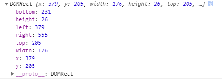

## 说明

- **element.getBoundingClientRect()** 方法用于获取某个元素相对于视窗的位置集合；
- 该集合中包含**top** 、**right**、**bottom**、**left**、**width**、**height**、**x** 和 **y** 属性；

如下图所示：

## 详解

- 函数返回一个 **TextRectangle** 对象，通过该对象获取元素属性；

