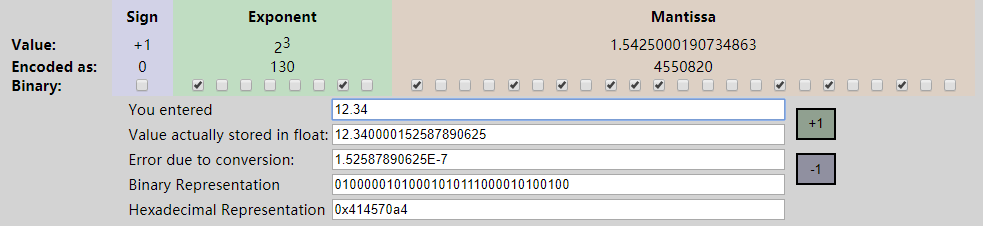

[TOC]

## 数据结构的字节数

常用的数据结构的字节数由平台决定，可以用 `sizeof()`方法查看， 例如，在x86平台上，如下：

```c
sizeof(int);    //4
sizeof(short);  //2
sizeof(long);   //4
sizeof(float);  //4
sizeof(double); //8
sizeof(char);   //1
sizeof(WORD);   //2
sizeof(DWORD);  //4
```

具体可以参考文章 **C sizeof()用法汇总**

## 浮点型的内存存储方式

整形和字符型毫无疑问，但是浮点型的存储却是一个问题，以 **x86** 平台和 **float** 为例为例，浮点型的存储由三部分构成，依次是：符号位、指数位、有效位。

可以使用：<https://www.h-schmidt.net/FloatConverter/IEEE754.html> 查看浮点型数据的存储方式

### 说明

**float** 在内存种占4个字节，32位（详细情况可以参考字节和内存的文章）

从高位到地位排列：1位符号位 + 8位指数为 + 23位尾数位，如下图（以12.34为例）所示：



**符号位：**占一位，1表示负数，0表示正数

**指数位：**占8位，表示指数，计算时的基数为2

​	因为指数可以有正负，所以8位指数的范围是：-128~127，因此，在计算时，8位二进制转换位转换成十进制后再减去127，即为指数。上图中，指数位是：1000,0010，十进制130，指数为3

**尾数位：**占23位

​	计算方式从左到右依次位2的负幂运算，上图中，尾数位是：100,0101,0111,0000,1010,0100，尾数位=`1*2^-1 + 0*2^-2 + 0*2^-3 ...`，算出结果为：1.5425000190734863

综上，最终表示的浮点数为：+1 * 2^3 * 1.5425000190734863

由计算方式可以看出，浮点数的存储只是一个近似数，故而在代码中不能使用 **==** 来进行判断

同理，**double** 占8个字节，存储方式：1位符号位 + 11位指数位 + 52位尾数位

## 精度

从存储方式可以看出，浮点数的存储是使用科学计数法，因此小数精度由尾数位决定：

float：2^23 = 8388608，共7位，即最多保存7位有效数字，即精度为6~7位有效数字

double：2^52，共16位，精度为15~16位有效数字