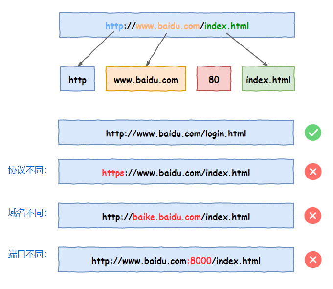
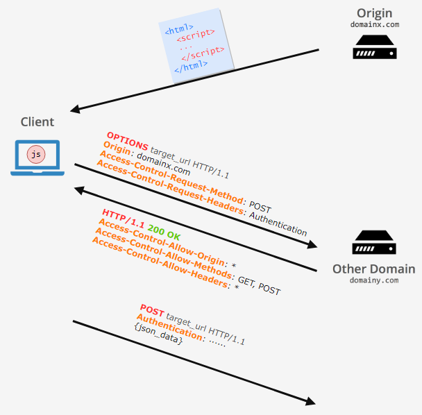

# 1、说明

https://www.cnblogs.com/xuanyuan/p/12979841.html

该文基于故事图文并茂地讲述了跨域的前生今世，因为文章是故事形式，里面的一些要点都只是一提而过，下面再次总结一下，顺序就和该文讲述的顺序一致

本文参考文章有：

https://blog.csdn.net/xiaoxinshuaiga/article/details/80766369

https://developer.mozilla.org/zh-CN/docs/Web/HTTP/Access_control_CORS

https://www.cnblogs.com/dowinning/archive/2012/04/19/json-jsonp-jquery.html

# 2、浏览器的基本原理

浏览器的职责划分包括：

1. 负责网络连接部分；
2. 负责存储管理部分，管理 **Cookie、LocalStorage 、SessionStorage** 等；
3. 网页渲染部分；
4. JS引擎；

网页渲染负责把来自网络的HTML文件进行解析，构建DOM树，再拿CSS文件，构建CSSOM树，最后把网页划出来


网页在渲染的时候，遇到 **\<script\>** 标签，则需要JS引擎来处理，然后接着下面的渲染，这个很重要。因为在执行 JS 代码的时候，有可能会去修改构建的DOM树的内容，所以，一次性构建完DOM树，在执行 JS 代码是不可取的。

# 3、禁止跨域

当网页所在的URL和目标URL只要有协议、域名、端口其中一个不同，即算跨域，如下图所示



跨域会引起网络安全的问题，最典型的就是 **CSRF攻击**，即跨站请求伪造。

CSRF攻击的大致原理是钓鱼网站冒用正规网站的身份验证，使请求合理化，过程如下：

1. 用户先打开浏览器，访问受信任的网站A，并使用正确的用户名和密码登陆网站A；
2. 成功登陆网站A后，网站A产生Cookie信息并返回给浏览器，浏览器保存此Cookie；
3. 用户未退出A网站，Cookie有效，同时，在同一个浏览器中打开了钓鱼网站B；
4. B网站返回攻击性代码，并发出请求要求访问第三方网站A；
5. 浏览器根据B的请求，在用户不知情待着保存的用户登陆A网站的Cookie，向网站A发出请求，此请求完全合法，网站A无法识别，导致被恶意攻击；

防止CSRF攻击的典型方法是生成验证token，本文不详述

## 3.1、禁止跨域导致的问题

因为跨域访问会导致类似的安全问题，所以有的公司就制定了禁止跨域访问的规定，但是禁止跨域访问就会导致一系列的问题。比如网页中的引入的外部css和js文件全部失效。

为了避免这种情况，这些公司就对跨域的请求进行一些修改，规定，引入外部文件的时候，可以忽略禁止跨域的限制，在前端中，就是所有带有 **src** 属性的元素都可以跳过跨域限制，比如 **\、\<script\>、\<link\>** 等，这样就解决了引入外部文件失效的问题

# 4、JSONP

随着技术的发展，web 开发流行前后端分离技术，前端不仅仅要展示静态页面，还需要向服务器请求数据动态展示，但是前端的网页和后端的接口经常不在一台服务器上，由于跨域的限制，前端使用AJAX的请求会被拒绝。

此时，有人就想到，前端带有 **src** 属性的元素可以跳过跨域的限制，可以利用这一特性，进行数据交互

首先，我们要知道，src 属性的资源请求是基于 HTTP 协议中的 GET 方法，因此，前端的请求就可以通过此方法传递到后端。

前端在请求的时候，预先写好数据处理的回调函数，将需要请求的参数和回调函数一起传递到后端，后端使用回调函数包裹需要的数据传到前端，即可完成一次通信。

此时发现，正好有一种JSON的数据格式，可以方便地描述数据，而且又是JS的原生数据类型，可以很方便地被前端解析，所以后端在处理的时候，使用回调函数包裹的数据使用JSON类型。

自此，前后端的数据传输有了一个非正式的传输协议，因为使用JSON格式，所以称之为 **JSONP（JSON with Padding）**

**示例如下：**

首先，前端能有请求静态资源

```html
<!DOCTYPE html PUBLIC "-//W3C//DTD XHTML 1.0 Transitional//EN" "http://www.w3.org/TR/xhtml1/DTD/xhtml1-transitional.dtd">
<html>
<head>
    <title></title>
    <script type="text/javascript" src="http://server.com/test.js"></script>
</head>
</html>
```

上例中，服务端的 test.js 脚本能够请求到，

```html
<!DOCTYPE html PUBLIC "-//W3C//DTD XHTML 1.0 Transitional//EN" "http://www.w3.org/TR/xhtml1/DTD/xhtml1-transitional.dtd">
<html xmlns="http://www.w3.org/1999/xhtml">
<head>
    <title></title>
    <script type="text/javascript">
    var testFunction = function(data){
        alert('客户端调用，数据为：' + data.data + "," + data.message);
    };
    </script>
    <script type="text/javascript" src="http://server.com/test.js"></script>
</head>
</html>
```
后端的 test.js 内容如下：
```javascript
testFunction({
    "data": 1234,
    "message": "OK"
});
```

示例中，testFunction() 函数定义好之后，接下来的标签请求后端的js脚本，得到之后，执行testFunction() 方法，数据也顺利传递进来了

然后，逐渐演化，后端的脚本也不用写死，因为src是GET方法，可以将回调函数直接传给后端，让后端解析

```html
<!DOCTYPE html PUBLIC "-//W3C//DTD XHTML 1.0 Transitional//EN" "http://www.w3.org/TR/xhtml1/DTD/xhtml1-transitional.dtd">
<html xmlns="http://www.w3.org/1999/xhtml">
<head>
    <title></title>
    <script type="text/javascript">
    var testFunction = function(data){
        alert('客户端调用，数据为：' + data.data + "," + data.message);
    };
    </script>
    <script type="text/javascript" src="http://server.com?param=price&cllbask=testFunction"></script>
</head>
</html>
```

逐渐地，各大主流框架都有了 JSONP 的封装，这里不再一一列举，但是需要注意的事是，JSONP 虽然看起来和 Ajax 相似，但是本质上和 Ajax 是两种不同的方式

# 5、CORS

有了 JSONP，跨域的问题暂时解决了，但是 JSONP 怎么看都是一种取巧的技术，使用起来会有很多的限制，比如只能使用 GET 方法，调用失败也不会返回错误等

后来，浏览器厂商推出了 **CORS(Cross-origin resource sharing)** 技术，CORS 是一种浏览器机制，它使用 HTTP 的协议头来允许不同服务器的请求

CORS 的大致方式是，在正式的请求之前，先发一个 **OPTION** 请求，询问服务器是允许接下来的跨域请求。约定，在 OPTION 请求中新增几个字段

- **Origin**： 发起请求原来的域；

- **Access-Control-Request-Method**： 将要发起的跨域请求方式（GET/POST等）；
- **Access-Control-Request-Headers**： 将要发起的跨域请求中包含的请求头字段

服务器在 OPTION 请求的 response 中表明是否允许此跨域

- **Access-Control-Allow-Origin**： 允许的域（*表示所有域）
- **Access-Control-Allow-Method**： 允许哪些请求方式（GET/POST等）
- **Access-Control-Allow-Headers**： 允许哪些请求头字段
- **Access-Control-Allow-Credentials**： 是否允许携带Cookie

如下图所示



浏览器接受到服务器的 response 后，检查，如果不符合要求，就拒绝接下来的请求

然而，每次请求都先发起一次 OPTION 预请求费时费力费资源，因此，又约定，有两种方式，可以避免预检请求:

一是 **简单请求**，即不会触发 CORS预检请求的请求。符合下面所有条件的请求，即为简单请求：

1. 使用的方式为 GET/POST/HEAD 其中之一；
2. HTTP 请求头中不超过以下五种字段：
   1. Accept
   2. Accept-Language
   3. Content-Language
   4. Last-Event-ID
   5. Content-Type
3. Content-Type 的值仅限于以下三者之一：
   1. text/plain
   2. multipart/form-data
   3. application/x-www-form-urlencoded

二是，在前一次请求之后，服务器的 response 中会带有一个 **Access-Control-Max-Age** ，表明这个询问的有效期，浏览器的请求在有效期内的，也可不进行预检请求

# 6、CORS和JSONP的比较

CORS 和 JSONP 的方式不同，但是目的相同，CORS 的功能比 JSONP强大太多

JSONP 因为使用 src 值来请求，所以只支持 GET 方法，而 CORS 支持所有类型的 HTTP请求

但是，JSONP 可以支持老式的浏览器，还可以向不支持 CORS 的服务器请求数据