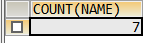
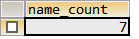

## 说明

- **AS** 的作用是给列指定一个别名；
- 别名可以用在 **GROUP BY**、**ORDER BY** 、**HAVING**等语句中；
- 指定别名也可以不用AS关键字，而是直接将别名写在后面，但是建议还是写AS；

## 示例

```sql
SELECT COUNT(name) FROM table_1;
```

结果类似下图结构：



```sql
SELECT COUNT(NAME) AS name_count FROM table_1;
SELECT COUNT(NAME) name_count FROM table_1;
```

指定别名之后，结果如下



## 进阶用法

待整理