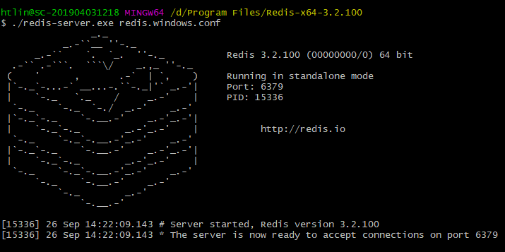

[TOC]

**本文列举了Redis常用的一些命令**

# 服务端

## 开启服务

使用配置文件的配置开启redis服务

```
redis-server redis.windows.conf
```



# 客户端

## 1、登陆
本地登陆：
```
redis-cli
```
远程登录：
```
redis-cli -h host -p port -a password
```

登陆后，可以使用 ***PING*** 指令查看redis服务是否启动

## 2、keys命令

| 序号 | cmd                 | description                       |
| ---- | ------------------- | --------------------------------- |
| 1    | DEL key             | 删除存在key                       |
| 2    | DUMP key            | 序列化key，返回序列化的值         |
| 3    | EXISTS key          | 查看key是否存在                   |
| 4    | TYPE key            | 查看key存储的值得类型             |
| 5    | RENAME key newKey   | 重命名key，newKey存在，则覆盖旧值 |
| 6    | RENAMENX key newKey | 仅当newKey不存在是，重命名        |

## 3、string

| 序号 | cmd                       | description |
| ---- | ------------------------- | ----------- |
| 1    | SET key value             | 设置 |
| 2    | GET key                   | 获取 |
| 3    | GETRANGE key start length | 截取子串 |
| 4    | GETSET key value          | 设置，并返回旧值 |
| 5 | MSET key1 value1 key2 value2 ... | 同时设置多个值 |
| 6    | MGET key1 key2 key3 ...   | 同时获取多个值 |
| 8    | SETNX key value           | key不存在时设置 |
| 9    | STRLEN key                | 获取数值长度 |
| 10   | APPEND key value | 在现有的值后面追加 |

## 4、hash

| 序号 | cmd                                      | description |
| ---- | ---------------------------------------- | ----------- |
| 1    | HDEL key field1 field2...                | 删除hash中的某个字段 |
| 2    | HEXISTS key field                        | 查看hash中某个字段是否存在 |
| 3 | HSET key field value | 给字段设置值 |
| 4    | HGET key field                           | 获取字段的值 |
| 5    | HMSET key field1 value1 field2 value2... | 批量设置值 |
| 6 | HMGET key field1 field2 | 批量获取值 |
| 7    | HGETALL key                              | 获取hash的所有字段和值 |
| 8    | HKEYS key                                | 获取hash的所有字段 |
| 9    | HSETNX key field value | 只有在字段不存在时，设定值 |
| 10 | HVALE key | 获取hash中的所有值，不分字段 |

## 5、list

- Redis的list是一个双向链表，利用表头和表尾，可以同时实现队列和栈两种数据类型；
- **Redis默认左边是表头，所以left表示表头，right表示表尾；**
- 命令中的 **B** 可以理解为 **block**，即阻塞；
- 命令中的 **timeout** 以 s 计；
- 命令中的 **l** 即 **left**，**R** 即 **right**，LPUSH/LPOP等命令，也适用于RPUSH/RPOP等，下表不再统计；

| 序号 | cmd                            | description                                                  |
| ---- | ------------------------------ | ------------------------------------------------------------ |
| 1    | LPUSH key value1 value2...     | 依次在表头插入元素，key不存在则创建                          |
| 2    | LPUSHX key value1 value2...    | key存在时，插入元素                                          |
| 3    | LPOP key                       | 取出表头的第一个元素                                         |
| 4    | BLPOP key1 key2... timeout     | 取出列表中的第一个元素<br>如果列表没有元素，则会阻塞，直到有元素，或者超时<br> |
| 5    | BRPOPLPUSH list1 list2 timeout | 取出list1的表尾，插入list2表头中，list1为空则超时等待        |
| 6    | LLEN key                       | 获取list长度，这里L是list，不是left                          |
| 7    | LRANGE key start length        | 获取指定范围的元素，L是list                                  |
| 8    | LREM key count value           | 移除list中前count次出现的value<br>count = 0，则移除全部<br>count < 0，则从表尾开始查找<br>count > 0，则从表头开始查找 |
| 9    | LTRIM key start end            | 截取链表，start/end使用负数表示从表尾开始                    |
| 10 | LSET key index value | 通过index设置链表值，index为负表示从表尾开始 |

## 6、set

| 序号 | cmd                                  | description                               |
| ---- | ------------------------------------ | ----------------------------------------- |
| 1    | SADD key m1 m2...                    | 向集合中添加成员                          |
| 2    | SMEMBERS key                         | 获取集合所有成员                          |
| 3    | SDIFF key1 key2 ...                  | 返回所有集合测差集                        |
| 4    | SINTER key1 key2 ...                 | 返回所有集合的交集                        |
| 5    | SINTERSTORE destination key1 key2... | 返回所有集合的交集，并存储在destination中 |
| 6    | SISMEMBER key member                 | 判断key中是否存在member                   |
| 7    | SCARD key                            | 获取集合中的成员数                        |
| 8    | SMOVE source dest member             | 将成员从source移动至dest                  |
| 9    | SPOP key                             | 移除并返回set中的一个随机元素             |
| 10 | SRANDMEMBER key count | 移除set中的一个或多个随机元素 |

## 7、zset

| 序号 | cmd                       | description               |
| ---- | ------------------------- | ------------------------- |
| 1    | ZADD key m1 m2 m3...      | 添加成员                  |
| 2    | ZCARD key                 | 获取成员数                |
| 3    | ZCOUNT key min max        | 计算score区间内的成员数   |
| 4    | ZRANGEBYSCORE key min max | 返回指定score区间内的成员 |

