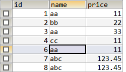
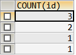
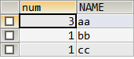
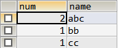

[TOC]

## GROUP BY说明：

- 根据指定规则对数据进行分组，并对各个组进行数据处理；
- 一般和聚合函数一起使用，单独使用可能得到意外的数据；

###　示例：

**原始数据如下：**



```sql
SELECT COUNT(id) FROM table_1;
SELECT COUNT(id) FROM table_1 GROUP BY name;
```



- 没有 **GROUP BY** 则会得到表中所有数据数量；
- 加上 **GROUP BY** 则会柑橘 **name** 字段进行分类，得到每组 **name** 的数据数量；

```sql
SELECT COUNT(id) FROM table_1 GROUP BY name ORDER BY COUNT(id);
```

- 集合 **ORDER BY** 可以对统计的结果进行排序；

## WHERE 和 HAVING

- WHERE子句在分组前进行筛选；
- HAVING子句在分组后过滤数据；

###　示例

```sql
SELECT COUNT(NAME) AS num, NAME FROM table_1 WHERE price<100 GROUP BY NAME;
```

- 在分组前，price < 100的数据被剔除了；



```sql
SELECT COUNT(NAME) AS num, NAME FROM table_1 GROUP BY NAME HAVING num<3;
```

- HAVING 一般对分组的列进行筛选，所以子句的条件必须是组列，即这里不能使用price作为条件；




