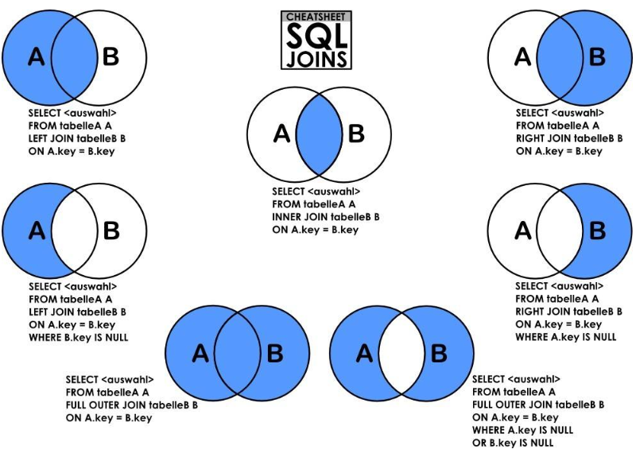

[TOC]

## 说明

***join*** 的作用是连接 ***多张表*** 进行数据查找，多表连接的基本语法如下：

```mysql
...FROM table1 INNER|LEFT|RIGHT JOIN table2 ON condition INNER|LEFT|RIGHT table3 ON condition ...
```

## 分类

### 根据状态分类

多张表的连接状态可以分为七类，分别是：**内连接**、**左外连接**、**右外连接**、**左连接**、**右连接**、**全连接**、**全外连接**。如下图：



### 根据sql语句分类

具体操作可以分成四种，如下所示：

```sql
INNER JOIN/JOIN
LEFT JOIN
RIGHT JOIN
FULL OUTER JOIN - mysql不支持，使用用UNION代替
```

根据组合可以组合成以上七种。

## 详解

以下以两张表连接作为示例，三张及其以上的表以此类推。

### 1、内连接

**结果：**满足 ***on*** 条件即可

又称自然连接或者全等连接，即左表和右表的共有数据。

**内连接文氏图**


***sql* 语句**

```mysql
SELECT * FROM table_a a INNER JOIN table_b b ON a.id=b.aid;
```

### 2、左连接

**结果：**返回 **左表全部行** 和 **右表满足 *on* 条件的行**

注：若右表没有和坐标匹配的项，则右表用 ***NULL*** 代替，所以，可以使用 ***where*** 来进一步限定

左连接有以下两种方式：

**左外连接文氏图：**


**左连接文氏图：**


***sql* 语句：**

```mysql
SELECT * FROM table_a a LEFT JOIN table_b b ON a.id=b.aid;
SELECT * from table_a a LEFT JOIN table_b b ON a.id=b.aid WHERE b.aid is null;
```

### 3、右连接

**结果：**返回 **右表全部行** 和 **左表满足 *on* 条件的行**

右连接分成一下两种方式：

**右外连接文氏图：**


**右连接文氏图：**


***sql* 语句：**

```sql
SELECT * FROM table_a a RIGHT JOIN table_b b ON a.id=b.aid;
SELECT * FROM table_a a RIGHT JOIN table_b b ON a.id=b.aid WHERE a.id is null;
```

### 4、全连接

**结果：**返回 **左表的所有数据** + **右表的所有数据** + **左右表的共有数据**

可以使用 ***union*** + ***left/right join*** 

**全连接文氏图：**


***sql* 语句：**

```sql
SELECT * FROM table_a a LEFT JOIN table_b b ON a.id=b.aid
UNION
SELECT * FROM table_a a RIGHT JOIN table_b b ON a.id=b.aid;
```

注：虽然 ***UNION*** 前后都会得到重合的数据，但是最后的结果中，不会出现重复数据。

### 5、全外连接

**结果：**返回 **左表的所有数据** + **右表的所有数据** - **左右表的共有数据**

可以使用 ***union*** + ***left/right join*** + ***where***

**全外连接文氏图：**


***sql* 语句**：

```sql
SELECT * FROM table_a a LEFT JOIN table_b b ON a.id=b.cid WHERE b.cid is null
UNION 
SELECT * FROM table_a a RIGHT JOIN table_b b ON a.id=b.cid WHERE a.id is null;
```

## on 和 where的区别

由上例子可以看出，**on** 作为建立关系的规则，**where** 作为结果的删选，即 **join-on** 检索到数据之后，在根据 **where** 对结果进行删选