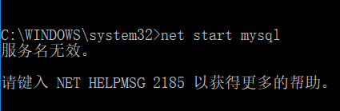

- 使用附件安装包，安装mysql；

- 安装完成之后，使用net start mysql启动

- 使用net stop mysql停止

## 问题：

### 服务名无效。请键入 NET HELPMSG 2185 以获得更多的帮助。

如下图：



**解决方案：**

services.msc，打开服务，找到MySql服务，查看名称，比如这里的名称是MySQL80，则，指令改成：net start mysql80和net

## 服务列表中没有mysql的相关服务

**解决方法：**

使用管理员权限打开cmd.exe，进入mysql的安装目录下的bin文件夹下，执行如下指令：

```python
mysqld.exe -install
```

成功之后，出现

```python
Service successfully installed.
```

最后，可以使用 **net start mysql** 指令启动服务