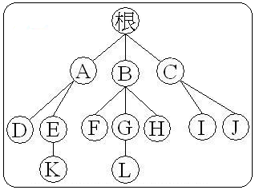
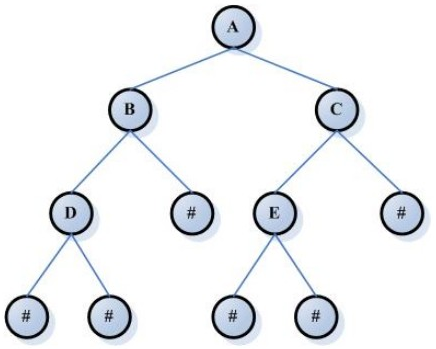
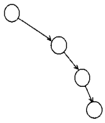
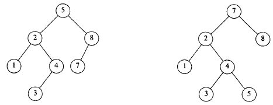
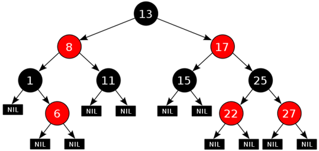

[TOC]

## 树形结构的优势

数据量大的时候，链表的线性访问时间太慢，使用树形结构，可以保证操作的平均时间复杂度为**O(logN)** 

## 基本结构

- **结点：** 每个数据元素都是结点
- **根：** 最上面的结点
- **父结点：**相对的上层结点，A是E的父结点
- **兄弟结点：**具有相同父结点的结点，D和E互称兄弟结点
- **度：**结点所拥有的子树的个数，A的度为2，B的度为3
- **树叶/终端结点：**度为0的结点，即没有子树的结点，D/K/F/L/H/I/J都是树叶
- **分支结点/非终端结点/内部结点：**度不为0的结点
- **结点的层次：**从根结点到所指结点的分支数，根结点层次为1，E的层次为3
- **深度：**最大层次数，E的深度为3

## 二叉树

- 每个结点不能多于两个子树；
- **平均二叉树的深度要比结点个数N小的多；**

### 二叉查找树

**对于树中的每个结点X， 其左子树中所有项的值均小于X，而其右子树中所有项的值均大于X。**

- 主要应用于查找；

### 不平衡树

- 生成二叉树/二叉查找树的时候，易失衡，最后坏的情况是一边倒（即只有左子树/右子树）；

- 树的深度达到了N；
- 对树数据的检索效率大大降低；

### AVL树

- 一种带有平衡条件的二叉查找树；
- 树的深度是O(logN)；

#### 平衡条件

1. 空树；
2. 每个结点的左子树和右子树的深度最多差1；

**示例：**

上图，左边的是AVL树，右侧不是，因为左子树的深度为3，右子树的深度为1，相差2

可以证明：

​	**一个AVL树的深度最多为：1.44 * log( N + 2) - 1.328，实际高度只是略大于logN**

### 红黑树 - R-B Tree

是AVL树的变种；结点是红色或者黑色的平衡二叉树，通过颜色约束来平衡二叉树。

Java的 **TreeMap** 和 **TreeSet** 就是红色书的典型实现。

#### 平衡规则：

1. 每个结点只能是红色或者黑色；
2. 根节点是黑色；
3. 每片叶子都是黑色；
4. 红色结点的两个子节点都是黑色，即，一条路径上不能出现相邻的两个红色结点；
5. 从任一结点到其每个叶子的所有简单路径所包含的黑色结点的树木相同；

