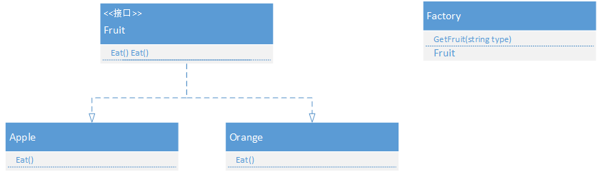
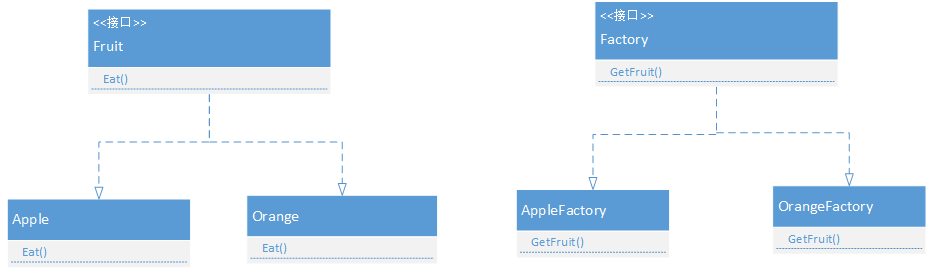

参考：<https://www.jianshu.com/p/38493eb4ffbd>

## 简介

- 属于创建型模式，用于对象创建
- 不对客户端暴露创建逻辑和实实现逻辑

## 优点

- 解耦
  - 传统意义上，new的一个对象需要改变，则需要改变所有new对象的地方
  - 使用工厂类来处理对象的生成，完全将new对象的行为封装起来，万一需要改变对象，则只需要修改工程类即可

##　分类

1. 简单工厂模式
2. 工厂方法模式
3. 抽象工厂模式

三种方式的抽象程度逐渐提高，更具通用性。

### 简单工厂模式

- 用于业务简单的情况下

#### 结构图



- 客户端直接调用Factory类，传入类型，即可获取对象指针；
- 对象new的过程和实现类对客户端隐藏，客户端只要得到指针即可；

**缺点：**

- 新增产品需要修改工厂类，比如上例中，新增一种水果，则需要Factory，不使用于变化无常的产品需求；

### 工厂方法模式

解决简单工厂模式的缺陷，工厂方法模式将工厂类提取成一个接口或者抽象类；



如上图所示，Factory使用抽象接口，分别由AppleFactory和OrangeFactory继承，Factory指针分别new出对应的水果工厂，并获取水果类。

```c++
Factory* apple_factory = new AppleFactory();
Factory* pear_factory = new OrangeFactory();
Apple* apple = (Apple*)appleFactory.GetFruit();//获得苹果
Pear* pear = (Pear*)pearFactory.GetFruit();//获得橘子
```

**缺点：**

虽然解决了简单工厂模式的问题，但是在有很多产品的时候，需要创建很多工厂

### 抽象工厂模式

**用于复杂对象的的处理，待整理**