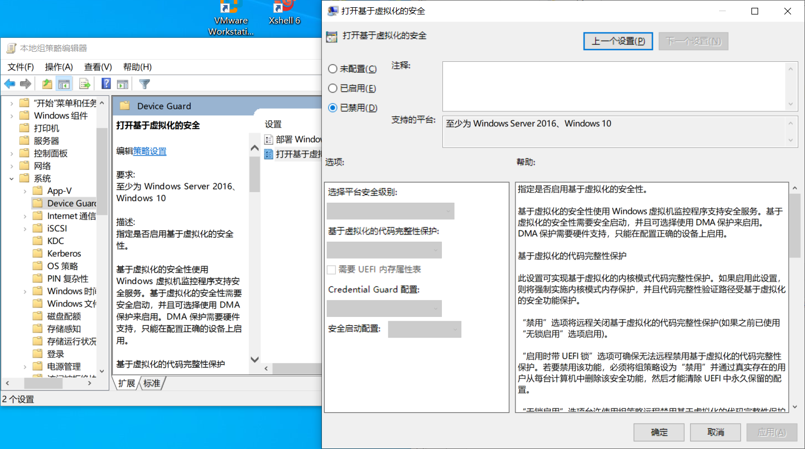

## 错误提示：

windows10选择ubuntu 64位系统时，提示不支持64位系统，安装了也不能使用

选择ios文件安装时，提示 安装Ubuntu64与Device/Credential Guard 不兼容

## 解决方法：

参考自：<https://www.cnblogs.com/hxwblogs/p/11717179.html>

### 步骤一：禁用Device Guard或Credential Guard

Win+R打开运行，输入gpedit.msc，进入编辑策略器(或者直接搜索编辑策略器)

　　然后依次点击>本地计算机策略 > 计算机配置 > 管理模板>系统 >Device Guard（或者是： 设备防护） > 打开基于虚拟化的安全性

　　然后直接选用禁用(如下图)



### 步骤二：依次打开控制面板 >卸载程序 >打开或关闭Windows功能

关闭Hyper-V(没有√即关闭)。

### 步骤三：

通过第2步的操作不能完全关闭Hyper-V 

需要以管理员身份运行Windows Powershell (管理员)（Win+X）

输入以下命令：

```bcdedit /set hypervisorlaunchtype off ```

最后重启电脑即可